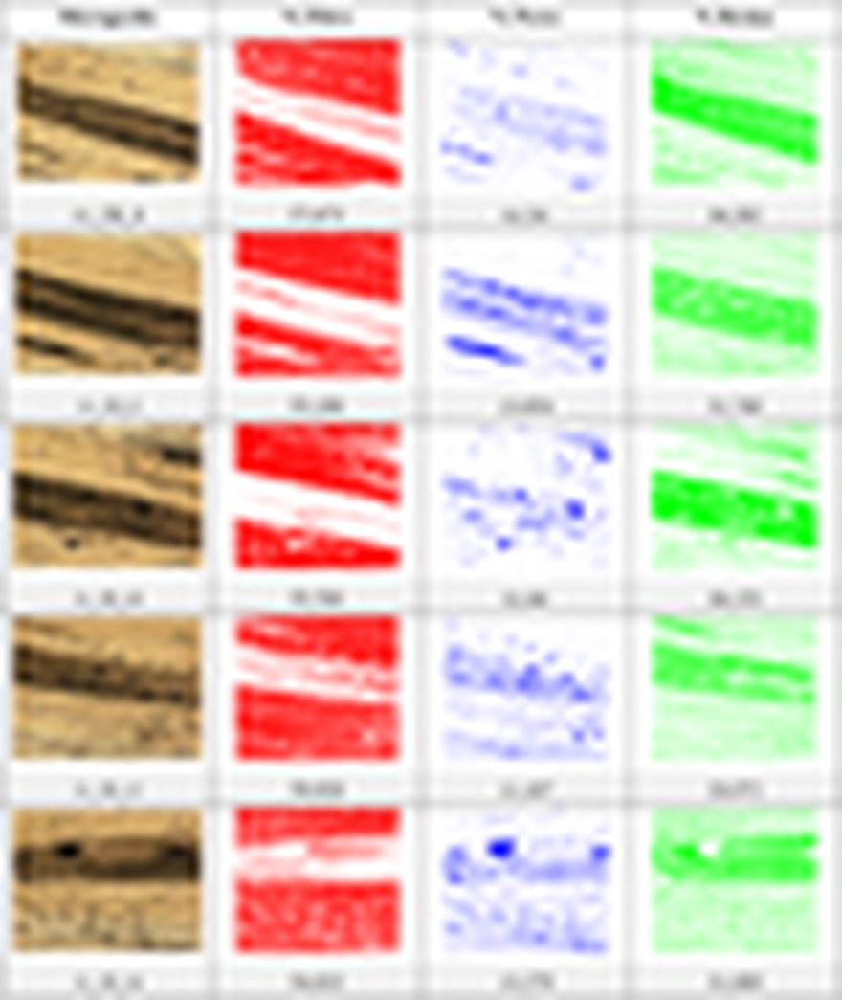
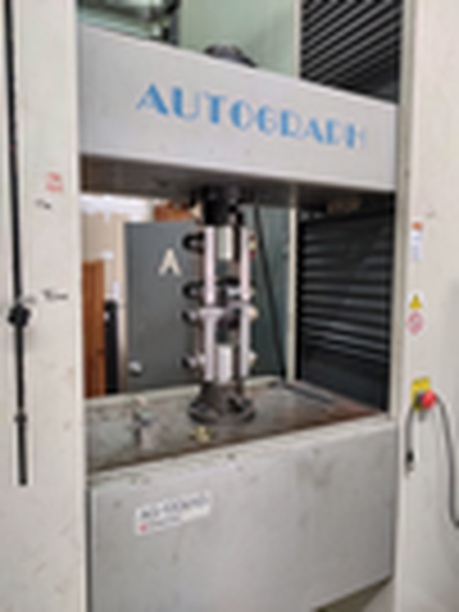
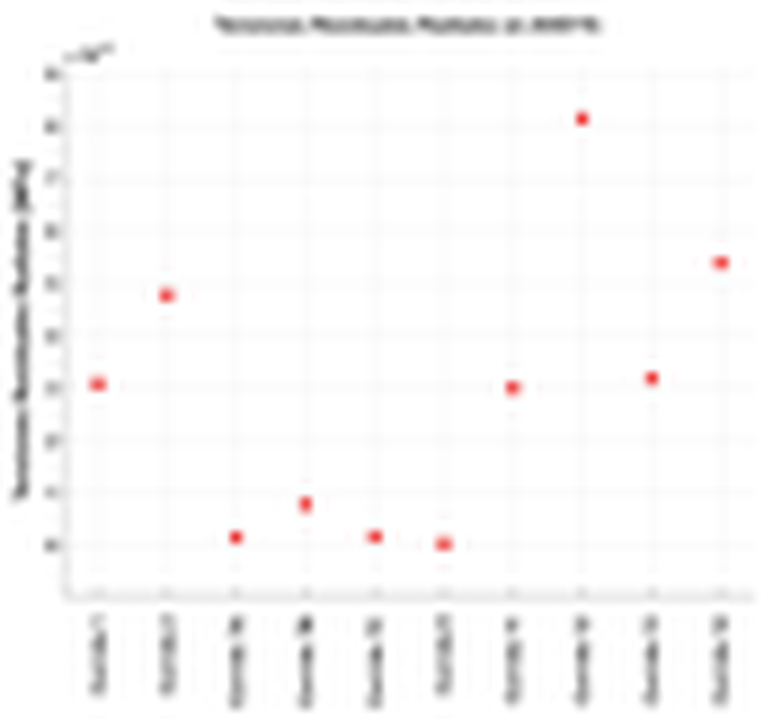

<a href="#cap-1">Enlaces iniciales y Capítulo 1</a>  
<a href="#cap-2">Capítulo 2</a>  
<a href="#cap-3">Capítulo 3</a>  
<a href="#cap-4">Capítulo 4</a>  
<a href="#cap-567">Capítulos 5, 6 y 7</a>  
<a href="#anexos">Anexos:</a>  
<a href="#referencias">Enlaces a las referencias externas</a>  
<a href="#figuras">Enlaces a las figuras</a>  
<a href="#tablas">Enlaces a las Tablas</a>  
<a href="#abreviaturas">Abreviaturas</a>

```js
const id_enlace =[
'agradecimientos',
'resumen',
'abstract',
'indice',
'tablas',
'figuras',
'simbolos',
'abreviaturas',
'capitulo_1',
'capitulo_1_1',
'capitulo_1_2',
'capitulo_1_3',
'capitulo_1_4',
'capitulo_1_5',
'capitulo_1_6',
'capitulo_2',
'capitulo_2_1',
'capitulo_2_1_1',
'capitulo_2_1_2',
'capitulo_2_1_3',
'capitulo_2_1_4',
'capitulo_2_2',
'capitulo_2_2_1',
'capitulo_2_3',
'capitulo_2_3_1',
'capitulo_2_3_2',
'capitulo_2_3_3',
'capitulo_2_3_4',
'capitulo_3',
'capitulo_3_1',
'capitulo_3_1_1',
'capitulo_3_1_2',
'capitulo_3_1_3',
'capitulo_3_1_4',
'capitulo_3_2',
'capitulo_3_2_1',
'capitulo_3_2_2',
'capitulo_3_2_3',
'capitulo_3_2_4',
'capitulo_3_2_5',
'capitulo_3_3',
'capitulo_3_3_1',
'capitulo_3_3_2',
'capitulo_3_3_3',
'capitulo_3_4',
'capitulo_3_4_1',
'capitulo_3_4_2',
'capitulo_3_4_3',
'capitulo_4',
'capitulo_4_1',
'capitulo_4_2',
'capitulo_4_3',
'capitulo_4_4',
'capitulo_4_5',
'capitulo_4_6',
'capitulo_4_7',
'capitulo_5',
'capitulo_5_1',
'capitulo_5_2',
'capitulo_5_3',
'capitulo_5_4',
'capitulo_5_5',
'capitulo_5_6',
'capitulo_6',
'capitulo_7',
'anexo_1',
'anexo_2',
'anexo_3',
'anexo_4',
'anexo_5',
'anexo_A_5_1',
'anexo_A_5_2',
'anexo_A_5_3',
'anexo_A_5_4',
'anexo_A_5_5',
'anexo_A_5_6',
'anexo_A_5_7',
'anexo_A_5_8',
'anexo_A_5_9',
'anexo_A_5_10',
'referencias',
];

const descripcion_larga = [
'Agradecimientos',
'Resumen',
'Abstract',
'Índice',
'Índice de Tablas',
'Índice de Figuras',
'Símbolos',
'Abreviaturas',
'Capítulo 1: Introducción.',
'Capítulo 1.1: Aplicación.',
'Capítulo 1.2: Objetivos generales.',
'Capítulo 1.3: Objetivos particulares.',
'Capítulo 1.3: Estado de Arte.',
'Capítulo 1.5: Hipótesis adoptadas.',
'Capítulo 1.6: Contenido.',
'Capítulo 2: Marco Teórico.',
'Capítulo 2.1: Sistema material compuesto.',
'Capítulo 2.1.1: Fibra de Carbono.',
'Capítulo 2.1.2: Matriz Epóxica.',
'Capítulo 2.1.3: Proceso de fabricación del material compuesto.',
'Capítulo 2.1.4: Propiedades mecánicas y físicas de la fibra y de la matriz.',
'Capítulo 2.2: Tensiones residuales.',
'Capítulo 2.2.1: Técnicas de medición de TR.',
'Capítulo 2.3: Cálculos complementarios.',
'Capítulo 2.3.1: Cálculo de las Constantes ingenieriles.',
'Capítulo 2.3.2: Cálculo de las TR según la mecánica del continuo.',
'Capítulo 2.3.3: Modelo de predicción de DR.',
'Capítulo 2.3.4: Modelo de elementos finitos propuesto.',
'Capítulo 3: Metodología.',
'Capítulo 3.1: Definición del DOE utilizado.',
'Capítulo 3.1.1: Selección de los Factores del DOE.',
'Capítulo 3.1.2: Niveles del DOE elegido.',
'Capítulo 3.1.3: Fraccionamiento del número de experimentos y obtención del DOE final.',
'Capítulo 3.1.4: Respuestas a estudiar del DOE.',
'Capítulo 3.2: Control de los factores del proceso de EF.',
'Capítulo 3.2.1: Tensión de bobinado.',
'Capítulo 3.2.2: Gradiente de ángulo entre pasadas.',
'Capítulo 3.2.3: Tiempo de bobinado.',
'Capítulo 3.2.4: Grosor de las capas.',
'Capítulo 3.2.5: Temperatura de la batea.',
'Capítulo 3.3: Preparación de las muestras.',
'Capítulo 3.3.1: Muestras para el análisis micrográfico.',
'Capítulo 3.3.2: Muestras para medir las DR.',
'Capítulo 3.3.3: Muestras para la medición de la Resistencia.',
'Capítulo 3.4: Obtención de las Respuestas del DOE.',
'Capítulo 3.4.1: Fracción en Volumen de las Fibras, Resina y Poros.',
'Capítulo 3.4.2: Evaluación de las DR mediante el Método del Corte.',
'Capítulo 3.4.3: Resistencia aparente de un aro de los tubos.',
'Capítulo 4: Resultados.',
'Capítulo 4.1: Fracción en volumen de fibra, resina y poros de las micrografías.',
'Capítulo 4.2: Constantes ingenieriles de cada tubo.',
'Capítulo 4.3: Deformaciones residuales.',
'Capítulo 4.4: TR calculadas a partir de ecuaciones de elasticidad.',
'Capítulo 4.5: DR predichas mediante la TCL.',
'Capítulo 4.6: TR predichas según el modelo de elementos finitos planteado.',
'Capítulo 4.7: Carreras máximas y Tensiones máximas según el estándar ASTM D 2290.',
'Capítulo 5: Discusión.',
'Capítulo 5.1: Fracción en volumen de Fibra.',
'Capítulo 5.2: Fracción en volumen de Poros.',
'Capítulo 5.3: Resistencia aparente alcanzada en el ensayo ASTM D 2290.',
'Capítulo 5.4: Carrera Máxima alcanzada en el ensayo ASTM D 2290.',
'Capítulo 5.5: Deformaciones Residuales (DR).',
'Capítulo 5.6: Tensiones Residuales.',
'Capítulo 6: Conclusión.',
'Capítulo 7: Trabajos a Futuro.',
'Anexo 1: Ficha Técnica de la Resina.',
'Anexo 2: Preparación de la resina.',
'Anexo 3: Tipos de pines.',
'Anexo 4: Ciclo de curado empleado.',
'Anexo 5: Resumen del Análisis mediante Micrografías.',
'Anexo A.5.1: Micrografías pertenecientes a la Corrida 1.',
'Anexo A.5.2: Micrografías pertenecientes a la Corrida 2.',
'Anexo A.5.3: Micrografías pertenecientes a la Corrida 7A.',
'Anexo A.5.4: Micrografías pertenecientes a la Corrida 7B.',
'Anexo A.5.5: Micrografías pertenecientes a la Corrida 7C.',
'Anexo A.5.6: Micrografías pertenecientes a la Corrida 8.',
'Anexo A.5.7: Micrografías pertenecientes a la Corrida 11.',
'Anexo A.5.8: Micrografías pertenecientes a la Corrida 12.',
'Anexo A.5.9: Micrografías pertenecientes a la Corrida 13.',
'Anexo A.5.10: Micrografías pertenecientes a la Corrida 14.',
'Referencias.',
];

const descripcion_corta =[
'Agradecimientos',
'Resumen',
'Abstract',
'Índice',
'Índice de Tablas',
'Índice de Figuras',
'Símbolos',
'Abreviaturas',
'Capítulo 1',
'Capítulo 1.1',
'Capítulo 1.2',
'Capítulo 1.3',
'Capítulo 1.4',
'Capítulo 1.5',
'Capítulo 1.6',
'Capítulo 2',
'Capítulo 2.1',
'Capítulo 2.1.1',
'Capítulo 2.1.2',
'Capítulo 2.1.3',
'Capítulo 2.1.4',
'Capítulo 2.2',
'Capítulo 2.2.1',
'Capítulo 2.3',
'Capítulo 2.3.1',
'Capítulo 2.3.2',
'Capítulo 2.3.3',
'Capítulo 2.3.4',
'Capítulo 3',
'Capítulo 3.1',
'Capítulo 3.1.1',
'Capítulo 3.1.2',
'Capítulo 3.1.3',
'Capítulo 3.1.4',
'Capítulo 3.2',
'Capítulo 3.2.1',
'Capítulo 3.2.2',
'Capítulo 3.2.3',
'Capítulo 3.2.4',
'Capítulo 3.2.5',
'Capítulo 3.3',
'Capítulo 3.3.1',
'Capítulo 3.3.2',
'Capítulo 3.3.3',
'Capítulo 3.4',
'Capítulo 3.4.1',
'Capítulo 3.4.2',
'Capítulo 3.4.3',
'Capítulo 4',
'Capítulo 4.1',
'Capítulo 4.2',
'Capítulo 4.3',
'Capítulo 4.4',
'Capítulo 4.5',
'Capítulo 4.6',
'Capítulo 4.7',
'Capítulo 5',
'Capítulo 5.1',
'Capítulo 5.2',
'Capítulo 5.3',
'Capítulo 5.4',
'Capítulo 5.5',
'Capítulo 5.6',
'Capítulo 6',
'Capítulo 7',
'Anexo 1',
'Anexo 2',
'Anexo 3',
'Anexo 4',
'Anexo 5',
'Anexo A.5.1',
'Anexo A.5.2',
'Anexo A.5.3',
'Anexo A.5.4',
'Anexo A.5.5',
'Anexo A.5.6',
'Anexo A.5.7',
'Anexo A.5.8',
'Anexo A.5.9',
'Anexo A.5.10',
'Referencias',
];

console.log(`${descripcion_corta.length}; ${descripcion_larga.length}; ${id_enlace.length}`); //81; 81; 81

```

```text
<a class='enlaces_referencias' href='./assets/referencias/Antonio Miravete (Eds.) (2007). “Materiales compuestos. Vol. 1”. Barcelona, Reverté.pdf' title='-Antonio Miravete (Eds.) (2007). "Materiales compuestos.Vol. 1". Barcelona, Reverté.' rel='noopener noreferrer'>A. Miravete, 2007</a>
<a class='enlaces_referencias' href='./assets/referencias/ASTM D 2290 (2004). Apparent Hoop Tensile Strength of Plastic or Reinforced Plastic Pipe by Split Disk Method.pdf' title='-ASTM D 2290 -04, "Standard Test Method for Apparent Hoop Tensile Strength of Plastic or Reinforced Plastic Pipe".' rel='noopener noreferrer'>ASTM D 2290</a>
<a class='enlaces_referencias' href='./assets/referencias/Barbero E. J. y Luciano (1995, R. Int. Journal Solids Structructures Vol. 32, Nº 13 (pp. 1859-1872). London UK Elsevier Sci.pdf' title='-Barbero, E. J. and Luciano, R. (1994). "Formulas for the stiffness of composites with periodic microstructure". Int. Journal Solids Structructures Vol. 31, Nº 21, (pp. 2933-2944). London, UK: Elsevier Science.' rel='noopener noreferrer'></a>
<a class='enlaces_referencias' href='./assets/referencias/Brian Hayes & Luther Gammon (2010). Optical Microscopy of Fiber Reinforced Composites. Ohio, USA. ASM International..pdf' title='-Brian Hayes & Luther Gammon (2010). "Optical Microcopy of Fiber Reinforced Composites". Ohio, USA. ASM International.' rel='noopener noreferrer'>Brian Hayes & Luther Gammon, 2010</a>
<a class='enlaces_referencias' href='./assets/referencias/Chao Kang et al. (2018). Determination of residual stress and design of process parameters for composite cylinder in filament winding. Adv. Mater. Sci. E.pdf' title='-C. Kang et al. (2018). "Determination of residual stress and design of process parameters for composite cylinder in filament winding". Adv. Mater. Sci. Eng. 1821342 1-11.' rel='noopener noreferrer'>C. Kang et al., 2018</a>
<a class='enlaces_referencias' href='./assets/referencias/catalogo_VISHAY_strain_Gages.pdf' title='-Catálogo de Vishay® Micro-meaurements & SR-4. Datos técnicos de la Galga Extensiométrica. Recuperado el 15/11/2023 del sitio https://www.ibselectronics.biz/pdf/cat500.pdf.' rel='noopener noreferrer'>catálogo de Vishay®</a>
<a class='enlaces_referencias' href='./assets/referencias/D. Cohen (1997) – Influence of filament Winding Parameters on Composite Vessel Quality and Strength.pdf' title='-D. Cohen (1997). "Influence of filament Winding Parameters on Composite Vessel Quality and Strength".Composites Part A-applied Science and Manufacturing, 28, 1035-1047.' rel='noopener noreferrer'>Cohen, 1997</a>
<a class='enlaces_referencias' href='./assets/referencias/Dumanli, A.G., Windle, A.H. (2012), “Carbon fibres from cellulosic precursors A review”, Journal of Materials Science 47(10), pp. 4236-4250.-2-16.pdf' title='-Dumanli, A.G., Windle, A.H. (2012), "Carbon fibres from cellulosic precursors: A review", Journal of Materials Science 47(10), pp. 4236-4250.' rel='noopener noreferrer'></a>
<a class='enlaces_referencias' href='./assets/referencias/E. J. Barbero (2011). “Introduction to composite materials design”. (2da. Edición). Boca Ratón, FL. Taylor and Francis Group, CRC Press..pdf' title='-E. J. Barbero (2011). "Introduction to composite materials design". (2da. Edición). Boca Ratón, FL.: Taylor and Francis Group, CRC Press.' rel='noopener noreferrer'>Barbero, 2011</a>
<a class='enlaces_referencias' href='./assets/referencias/E. J. Barbero (2014). Finite Element Analysis of Composite Materials Using ANSYS. (2da. Edición). Boca Ratón, FL. Taylor and Francis Group, CRC Press..pdf' title='-E. J. Barbero (2014). "Finite Element Analysis of Composite Materials Using ANSYS". (2da. Edición). Boca Ratón, FL.: Taylor and Francis Group, CRC Press.' rel='noopener noreferrer'></a>
<a class='enlaces_referencias' href='./assets/referencias/G. S. Schajer (2013). “Practical Residual Stress Meassuring Methods”. Sussex, Reino Unido. John Wiley & Sons Ltd..pdf' title='-G. S. Schajer (2013). "Practical Residual Stress Meassuring Methods". Sussex, Reino Unido. John Wiley & Sons Ltd.' rel='noopener noreferrer'></a>
<a class='enlaces_referencias' href='./assets/referencias/G. S. Schajer-USE OF INVERSE SOLUTIONS FOR RESIDUAL STRESS MEASUREMENT.pdf' title='-G. S. Schajer & M. B. Prime (2006). "Use of Inverse Solutions for Residual Stress Measurements". Journal of Engineering Materials and Technology, 128(3), 375-382.' rel='noopener noreferrer'>Gary S. Schajer y Michael B. Prime</a>
<a class='enlaces_referencias' href='./assets/referencias/Humberto Gutiérrez Pulido (2008). “Análisis y diseño experimentos”. México DC, McGrawHill..pdf' title='-Humberto Gutiérrez Pulido (2008). "Análisis y diseño experimentos". México DC, McGrawHill.' rel='noopener noreferrer'>H. G. Pulido, 2008</a>
<a class='enlaces_referencias' href='./assets/referencias/J. W. Kim and D. G. Lee, “Measurement of residual stresses in thick composite cylinders by the radial-cut-cylinder-bending method,” Composite Structures, vol. 77, no. 4, pp. 444–456, 2007..pdf' title='-J. W. Kim and D. G. Lee (2005). "Measurement of residual stresses in thick composite cylinders by the radial-cut-cylinder-bending method". Composite Structures, vol. 77, no. 4, pp. 444-456.' rel='noopener noreferrer'>J. W. Kim & D. G. Lee, 2005</a>
<a class='enlaces_referencias' href='./assets/referencias/Jones, R. M. (1999). “Mechanics of Composite Materials”. (2da. Edición). Washington, D.C. Taylor and Francis Group.pdf' title='-Jones, R. M. (1999). "Mechanics of Composite Materials". (2da. Edición). Washington, D.C.: Taylor and Francis Group.' rel='noopener noreferrer'></a>
<a class='enlaces_referencias' href='./assets/referencias/Jorge Domínguez Domínguez (2010). “Diseño de experimentos estrategias y análisis en ciencias e ingenierías”. México DC, Alfaomega..pdf' title='-Jorge Domínguez Domínguez (2010). "Diseño de experimentos: estrategias y análisis en ciencias e ingenierías". México DC, Alfaomega.' rel='noopener noreferrer'>Jorge Dominguez Dominguez, 2010</a>
<a class='enlaces_referencias' href='./assets/referencias/Koussios S. (2004). “Filament winding a unified approach” (Tesis Doctoral). Universidad Tecnológica de Delft, Países Bajos..pdf' title='-Koussios S. (2004). "Filament winding: a unified approach" (Tesis Doctoral). Universidad Tecnológica de Delft, Países Bajos.' rel='noopener noreferrer'></a>
<a class='enlaces_referencias' href='./assets/referencias/S. Lekhnitskii (1968). Anisotropic plates. Gordon and Breach .pdf' title='-Lekhnitskii S. (1968). "Anisotropic plates". Gordon and Breach, Science Publishers, Inc. New York.' rel='noopener noreferrer'></a>
<a class='enlaces_referencias' href='./assets/referencias/Lopez Betancur, D. A. (2022)._Caracterización de resina tipo epoxi en entornos radiactivos utilizada para la fabricación de CFRP (polímeros reforzados co.pdf' title='-Lopez Betancur, D. A. (2022)."Caracterización de resina tipo epoxi en entornos radiactivos utilizada para la fabricación de CFRP (polímeros reforzados con fibra de carbono)". Tesis de Maestría, Instituto sábato.' rel='noopener noreferrer'>Lopez Betancur, 2022</a>
<a class='enlaces_referencias' href='./assets/referencias/M. C. Waterbury and L. T. Drzal (1989) “Determination of Fiber Volume.pdf' title='-M. C. Waterbury and L. T. Drzal (1989). "Determination of Fiber Volume Fractions by Optical Numeric Volume Fraction Analysis". Journal of Reinforced Plastics and Composites, Vol. 8, November 1989, pp. 627 - 636.' rel='noopener noreferrer'>M. C. Waterbury and L. T. Drzal, 1989</a>
<a class='enlaces_referencias' href='./assets/referencias/M. Schlottermüller (2004) – Influence of Process Parameters in residual Stress in Thermoplastic Filament-Wound Parts.pdf' title='-M. Schlottermüller, R. Schledjewski y P. Mitschang (2004). "Influence of Process Parameters in residual Stress in Thermoplastic Filament-Wound Parts". Proceedings of the Institution of Mechanical Engineers, Part L: Journal of Materials: Design and Applic.' rel='noopener noreferrer'>M. Schlottermüller et al., 2004</a>
<a class='enlaces_referencias' href='./assets/referencias/MIL-HDBK-17-3F.pdf' title='-MIL-HDBK-17-3F (2002), "Composite materials handbook, volumen 3. Polymer matrix composites materials: usage, design, and analysis". MIL-HDBK-17-3F, 3, DoD, Fort Washington, PA, 2002.' rel='noopener noreferrer'>MIL-HDBK-17-3F</a>
<a class='enlaces_referencias' href='./assets/referencias/Morgan, Peter (2005). Carbon Fibers and their Composites. Taylor & Francis Group, LLC p. 167-170  305-306..pdf' title='-Morgan, Peter (2005). "Carbon Fibers and their Composites". Taylor & Francis Group, LLC p. 167-170 / 305-306.' rel='noopener noreferrer'></a>
<a class='enlaces_referencias' href='./assets/referencias/Myers , D. G. (2004). Method for Measurement of Residual Stress and Coeffi cient of Thermal Expansion of Laminated Composites , MSc Thesis, University of Florida..pdf' title='-Myers , D. G. (2004). "Method for Measurement of Residual Stress and Coefficient of Thermal Expansion of Laminated Composites". MSc Thesis, University of Florida.' rel='noopener noreferrer'></a>
<a class='enlaces_referencias' href='./assets/referencias/P. Casari (2006) – Characterizationi of Residual Stresses in Wound Composite Tubes.pdf' title='-P. Casari et al. (2006). "Characterization of Residual Stresses in Wound Composite Tubes". Composites Part A: Applied Science and Manufacturing, Volume 37, Issue 2, pp 337-343.' rel='noopener noreferrer'>P. Casari et al., 2006</a>
<a class='enlaces_referencias' href='./assets/referencias/R. H. Knibbs (1971), The use of polarized light microscopy in examining the structure of carbon fibres, Journal of Microscopy, 94273–281. httpsdoi.org10.1111j.1365-2.pdf' title='-R. H. Knibbs (1971), "The use of polarized light microscopy in examining the structure of carbon fibres", Journal of Microscopy, 94:273-281.' rel='noopener noreferrer'></a>
<a class='enlaces_referencias' href='./assets/referencias/S. Akbari (2012) – Slitting Measurement of Residual Hoop Stresses Through the Wall-Thickness of a Filament Wound Composite Ring.pdf' title='-S. Akbari et al. (2012). "Slitting Measurement of Residual Hoop Stresses Through the Wall-Thickness of a Filament Wound Composite Ring". Exp Mech 53, 1509-1518 (2013).' rel='noopener noreferrer'>S. Akbari et al., 2012</a>
<a class='enlaces_referencias' href='./assets/referencias/S. Nemat-Nasser y M. Hori (1999). “Micromechanics  Overall Properties  of Heterogeneous Materials”. Amsterdam, Holanda. Elsevier Science Publishers B.V..pdf' title='-S. Nemat-Nasser y M. Hori (1999). "Micromechanics : Overall Properties of Heterogeneous Materials". Amsterdam, Holanda: Elsevier Science Publishers B.V.' rel='noopener noreferrer'></a>
<a class='enlaces_referencias' href='./assets/referencias/S. T. Peters (2011). “Composite filament winding”. ASM International..pdf' title='-S. T. Peters (2011). "Composite filament winding". ASM International.' rel='noopener noreferrer'>Peters, 2011</a>
<a class='enlaces_referencias' href='./assets/referencias/Seif MA, Short SR. Determination of residual stresses in thin-walled composite cylinders. Exp Techniques. 2002;2643–46.pdf' title='-Seif M.A. (2002). "Determination of residual stresses in thin-walled composite cylinders". Exp Techniques.;2643-46.' rel='noopener noreferrer'>Seif M.A., 2002</a>
<a class='enlaces_referencias' href='./assets/referencias/Shokrieh, M.M.(2014), Residual Stresses in Composite Materials A volume in Woodhead Publishing Series in Composites Science and Engineering.pdf' title='-Shokrieh, M.M.(2014). "Residual Stresses in Composite Materials". Woodhead Publishing Series in Composites Science and Engineering. Recupedado el 29 de Marzo de 2022, de https://www.sciencedirect.com/book/9780128188170/residual-stresses-in-comp.' rel='noopener noreferrer'>Shokrieh, M.M., 2014</a>
<a class='enlaces_referencias' href='./assets/referencias/Timoshenko, S.P. and Goodier, N.J. (1987). “Theory of Elasticity”. McGraw Hill Publishing Co., New York.pdf' title='-Timoshenko, S.P. and Goodier, N.J. (1951). "Theory of Elasticity". McGraw Hill Publishing Co., New York.' rel='noopener noreferrer'>Timoshenko y Goodier, 1951</a>
<a class='enlaces_referencias' href='https://www.toraycma.com/products/carbon-fiber/' title='-Toray (2022), Fibras de Carbono de Toray®, Recupedado el 11 de Mayo de 2022, https://www.toraycma.com/products/carbon-fiber/.' rel='noopener noreferrer'>Toray, 2022</a>
<a class='enlaces_referencias' href='./assets/referencias/Toshio Mura (1987). Micromechanics of Defects in Solids. (2da. Edición). Dordrecht, Holanda Martinus Nijhoff Publishers..pdf' title='-Toshio Mura (1987). "Micromechanics of Defects in Solids". (2da. Edición). Dordrecht, Holanda: Martinus Nijhoff Publishers.' rel='noopener noreferrer'></a>
<a class='enlaces_referencias' href='./assets/referencias/Yamamoto G. et al. (2018), “Determination of Full Elastic Constants of Carbon Fiber in Carbon Fiber Reinforced Plastic Composites”. Sendai, Japón..pdf' title='-Yamamoto G. et al. (2018), "Determination of Full Elastic Constants of Carbon Fiber in Carbon Fiber Reinforced Plastic Composites". 33rd Technical Conference of the American Society for Composites 2018. DEStech Publications Inc. pp 1508-1514.' rel='noopener noreferrer'>Yamamoto et al., 2018</a>
```

```js
for (let i = 0; i < descripcion_larga.length; i++) {
console.log(`<a class="enlaces_capitulo" href="${id_enlace[i]}" title="${descripcion_larga[i]}" rel="noopener noreferrer">${descripcion_corta[i]}</a>`);
}

```

```text
<a class="enlaces_capitulo" href="agradecimientos" title="Agradecimientos" rel="noopener noreferrer">Agradecimientos</a>
<a class="enlaces_capitulo" href="resumen" title="Resumen" rel="noopener noreferrer">Resumen</a>
<a class="enlaces_capitulo" href="abstract" title="Abstract" rel="noopener noreferrer">Abstract</a>
<a class="enlaces_capitulo" href="indice" title="Índice" rel="noopener noreferrer">Índice</a>
<a class="enlaces_capitulo" href="tablas" title="Índice de Tablas" rel="noopener noreferrer">Índice de Tablas</a>
<a class="enlaces_capitulo" href="figuras" title="Índice de Figuras" rel="noopener noreferrer">Índice de Figuras</a>
<a class="enlaces_capitulo" href="simbolos" title="Símbolos" rel="noopener noreferrer">Símbolos</a>
<a class="enlaces_capitulo" href="abreviaturas" title="Abreviaturas" rel="noopener noreferrer">Abreviaturas</a>
<a class="enlaces_capitulo" href="capitulo_1" title="Capítulo 1: Introducción." rel="noopener noreferrer">Capítulo 1</a>
<a class="enlaces_capitulo" href="capitulo_1_1" title="Capítulo 1.1: Aplicación." rel="noopener noreferrer">Capítulo 1.1</a>
<a class="enlaces_capitulo" href="capitulo_1_2" title="Capítulo 1.2: Objetivos generales." rel="noopener noreferrer">Capítulo 1.2</a>
<a class="enlaces_capitulo" href="capitulo_1_3" title="Capítulo 1.3: Objetivos particulares." rel="noopener noreferrer">Capítulo 1.3</a>
<a class="enlaces_capitulo" href="capitulo_1_4" title="Capítulo 1.3: Estado de Arte." rel="noopener noreferrer">Capítulo 1.4</a>
<a class="enlaces_capitulo" href="capitulo_1_5" title="Capítulo 1.5: Hipótesis adoptadas." rel="noopener noreferrer">Capítulo 1.5</a>
<a class="enlaces_capitulo" href="capitulo_1_6" title="Capítulo 1.6: Contenido." rel="noopener noreferrer">Capítulo 1.6</a>
<a class="enlaces_capitulo" href="capitulo_2" title="Capítulo 2: Marco Teórico." rel="noopener noreferrer">Capítulo 2</a>
<a class="enlaces_capitulo" href="capitulo_2_1" title="Capítulo 2.1: Sistema material compuesto." rel="noopener noreferrer">Capítulo 2.1</a>
<a class="enlaces_capitulo" href="capitulo_2_1_1" title="Capítulo 2.1.1: Fibra de Carbono." rel="noopener noreferrer">Capítulo 2.1.1</a>
<a class="enlaces_capitulo" href="capitulo_2_1_2" title="Capítulo 2.1.2: Matriz Epóxica." rel="noopener noreferrer">Capítulo 2.1.2</a>
<a class="enlaces_capitulo" href="capitulo_2_1_3" title="Capítulo 2.1.3: Proceso de fabricación del material compuesto." rel="noopener noreferrer">Capítulo 2.1.3</a>
<a class="enlaces_capitulo" href="capitulo_2_1_4" title="Capítulo 2.1.4: Propiedades mecánicas y físicas de la fibra y de la matriz." rel="noopener noreferrer">Capítulo 2.1.4</a>
<a class="enlaces_capitulo" href="capitulo_2_2" title="Capítulo 2.2: Tensiones residuales." rel="noopener noreferrer">Capítulo 2.2</a>
<a class="enlaces_capitulo" href="capitulo_2_2_1" title="Capítulo 2.2.1: Técnicas de medición de TR." rel="noopener noreferrer">Capítulo 2.2.1</a>
<a class="enlaces_capitulo" href="capitulo_2_3" title="Capítulo 2.3: Cálculos complementarios." rel="noopener noreferrer">Capítulo 2.3</a>
<a class="enlaces_capitulo" href="capitulo_2_3_1" title="Capítulo 2.3.1: Cálculo de las Constantes ingenieriles." rel="noopener noreferrer">Capítulo 2.3.1</a>
<a class="enlaces_capitulo" href="capitulo_2_3_2" title="Capítulo 2.3.2: Cálculo de las TR según la mecánica del continuo." rel="noopener noreferrer">Capítulo 2.3.2</a>
<a class="enlaces_capitulo" href="capitulo_2_3_3" title="Capítulo 2.3.3: Modelo de predicción de DR." rel="noopener noreferrer">Capítulo 2.3.3</a>
<a class="enlaces_capitulo" href="capitulo_2_3_4" title="Capítulo 2.3.4: Modelo de elementos finitos propuesto." rel="noopener noreferrer">Capítulo 2.3.4</a>
<a class="enlaces_capitulo" href="capitulo_3" title="Capítulo 3: Metodología." rel="noopener noreferrer">Capítulo 3</a>
<a class="enlaces_capitulo" href="capitulo_3_1" title="Capítulo 3.1: Definición del DOE utilizado." rel="noopener noreferrer">Capítulo 3.1</a>
<a class="enlaces_capitulo" href="capitulo_3_1_1" title="Capítulo 3.1.1: Selección de los Factores del DOE." rel="noopener noreferrer">Capítulo 3.1.1</a>
<a class="enlaces_capitulo" href="capitulo_3_1_2" title="Capítulo 3.1.2: Niveles del DOE elegido." rel="noopener noreferrer">Capítulo 3.1.2</a>
<a class="enlaces_capitulo" href="capitulo_3_1_3" title="Capítulo 3.1.3: Fraccionamiento del número de experimentos y obtención del DOE final." rel="noopener noreferrer">Capítulo 3.1.3</a>
<a class="enlaces_capitulo" href="capitulo_3_1_4" title="Capítulo 3.1.4: Respuestas a estudiar del DOE." rel="noopener noreferrer">Capítulo 3.1.4</a>
<a class="enlaces_capitulo" href="capitulo_3_2" title="Capítulo 3.2: Control de los factores del proceso de EF." rel="noopener noreferrer">Capítulo 3.2</a>
<a class="enlaces_capitulo" href="capitulo_3_2_1" title="Capítulo 3.2.1: Tensión de bobinado." rel="noopener noreferrer">Capítulo 3.2.1</a>
<a class="enlaces_capitulo" href="capitulo_3_2_2" title="Capítulo 3.2.2: Gradiente de ángulo entre pasadas." rel="noopener noreferrer">Capítulo 3.2.2</a>
<a class="enlaces_capitulo" href="capitulo_3_2_3" title="Capítulo 3.2.3: Tiempo de bobinado." rel="noopener noreferrer">Capítulo 3.2.3</a>
<a class="enlaces_capitulo" href="capitulo_3_2_4" title="Capítulo 3.2.4: Grosor de las capas." rel="noopener noreferrer">Capítulo 3.2.4</a>
<a class="enlaces_capitulo" href="capitulo_3_2_5" title="Capítulo 3.2.5: Temperatura de la batea." rel="noopener noreferrer">Capítulo 3.2.5</a>
<a class="enlaces_capitulo" href="capitulo_3_3" title="Capítulo 3.3: Preparación de las muestras." rel="noopener noreferrer">Capítulo 3.3</a>
<a class="enlaces_capitulo" href="capitulo_3_3_1" title="Capítulo 3.3.1: Muestras para el análisis micrográfico." rel="noopener noreferrer">Capítulo 3.3.1</a>
<a class="enlaces_capitulo" href="capitulo_3_3_2" title="Capítulo 3.3.2: Muestras para medir las DR." rel="noopener noreferrer">Capítulo 3.3.2</a>
<a class="enlaces_capitulo" href="capitulo_3_3_3" title="Capítulo 3.3.3: Muestras para la medición de la Resistencia." rel="noopener noreferrer">Capítulo 3.3.3</a>
<a class="enlaces_capitulo" href="capitulo_3_4" title="Capítulo 3.4: Obtención de las Respuestas del DOE." rel="noopener noreferrer">Capítulo 3.4</a>
<a class="enlaces_capitulo" href="capitulo_3_4_1" title="Capítulo 3.4.1: Fracción en Volumen de las Fibras, Resina y Poros." rel="noopener noreferrer">Capítulo 3.4.1</a>
<a class="enlaces_capitulo" href="capitulo_3_4_2" title="Capítulo 3.4.2: Evaluación de las DR mediante el Método del Corte." rel="noopener noreferrer">Capítulo 3.4.2</a>
<a class="enlaces_capitulo" href="capitulo_3_4_3" title="Capítulo 3.4.3: Resistencia aparente de un aro de los tubos." rel="noopener noreferrer">Capítulo 3.4.3</a>
<a class="enlaces_capitulo" href="capitulo_4" title="Capítulo 4: Resultados." rel="noopener noreferrer">Capítulo 4</a>
<a class="enlaces_capitulo" href="capitulo_4_1" title="Capítulo 4.1: Fracción en volumen de fibra, resina y poros de las micrografías." rel="noopener noreferrer">Capítulo 4.1</a>
<a class="enlaces_capitulo" href="capitulo_4_2" title="Capítulo 4.2: Constantes ingenieriles de cada tubo." rel="noopener noreferrer">Capítulo 4.2</a>
<a class="enlaces_capitulo" href="capitulo_4_3" title="Capítulo 4.3: Deformaciones residuales." rel="noopener noreferrer">Capítulo 4.3</a>
<a class="enlaces_capitulo" href="capitulo_4_4" title="Capítulo 4.4: TR calculadas a partir de ecuaciones de elasticidad." rel="noopener noreferrer">Capítulo 4.4</a>
<a class="enlaces_capitulo" href="capitulo_4_5" title="Capítulo 4.5: DR predichas mediante la TCL." rel="noopener noreferrer">Capítulo 4.5</a>
<a class="enlaces_capitulo" href="capitulo_4_6" title="Capítulo 4.6: TR predichas según el modelo de elementos finitos planteado." rel="noopener noreferrer">Capítulo 4.6</a>
<a class="enlaces_capitulo" href="capitulo_4_7" title="Capítulo 4.7: Carreras máximas y Tensiones máximas según el estándar ASTM D 2290." rel="noopener noreferrer">Capítulo 4.7</a>
<a class="enlaces_capitulo" href="capitulo_5" title="Capítulo 5: Discusión." rel="noopener noreferrer">Capítulo 5</a>
<a class="enlaces_capitulo" href="capitulo_5_1" title="Capítulo 5.1: Fracción en volumen de Fibra." rel="noopener noreferrer">Capítulo 5.1</a>
<a class="enlaces_capitulo" href="capitulo_5_2" title="Capítulo 5.2: Fracción en volumen de Poros." rel="noopener noreferrer">Capítulo 5.2</a>
<a class="enlaces_capitulo" href="capitulo_5_3" title="Capítulo 5.3: Resistencia aparente alcanzada en el ensayo ASTM D 2290." rel="noopener noreferrer">Capítulo 5.3</a>
<a class="enlaces_capitulo" href="capitulo_5_4" title="Capítulo 5.4: Carrera Máxima alcanzada en el ensayo ASTM D 2290." rel="noopener noreferrer">Capítulo 5.4</a>
<a class="enlaces_capitulo" href="capitulo_5_5" title="Capítulo 5.5: Deformaciones Residuales (DR)." rel="noopener noreferrer">Capítulo 5.5</a>
<a class="enlaces_capitulo" href="capitulo_5_6" title="Capítulo 5.6: Tensiones Residuales." rel="noopener noreferrer">Capítulo 5.6</a>
<a class="enlaces_capitulo" href="capitulo_6" title="Capítulo 6: Conclusión." rel="noopener noreferrer">Capítulo 6</a>
<a class="enlaces_capitulo" href="capitulo_7" title="Capítulo 7: Trabajos a Futuro." rel="noopener noreferrer">Capítulo 7</a>
<a class="enlaces_capitulo" href="anexo_1" title="Anexo 1: Ficha Técnica de la Resina." rel="noopener noreferrer">Anexo 1</a>
<a class="enlaces_capitulo" href="anexo_2" title="Anexo 2: Preparación de la resina." rel="noopener noreferrer">Anexo 2</a>
<a class="enlaces_capitulo" href="anexo_3" title="Anexo 3: Tipos de pines." rel="noopener noreferrer">Anexo 3</a>
<a class="enlaces_capitulo" href="anexo_4" title="Anexo 4: Ciclo de curado empleado." rel="noopener noreferrer">Anexo 4</a>
<a class="enlaces_capitulo" href="anexo_5" title="Anexo 5: Resumen del Análisis mediante Micrografías." rel="noopener noreferrer">Anexo 5</a>
<a class="enlaces_capitulo" href="anexo_A_5_1" title="Anexo A.5.1: Micrografías pertenecientes a la Corrida 1." rel="noopener noreferrer">Anexo A.5.1</a>
<a class="enlaces_capitulo" href="anexo_A_5_2" title="Anexo A.5.2: Micrografías pertenecientes a la Corrida 2." rel="noopener noreferrer">Anexo A.5.2</a>
<a class="enlaces_capitulo" href="anexo_A_5_3" title="Anexo A.5.3: Micrografías pertenecientes a la Corrida 7A." rel="noopener noreferrer">Anexo A.5.3</a>
<a class="enlaces_capitulo" href="anexo_A_5_4" title="Anexo A.5.4: Micrografías pertenecientes a la Corrida 7B." rel="noopener noreferrer">Anexo A.5.4</a>
<a class="enlaces_capitulo" href="anexo_A_5_5" title="Anexo A.5.5: Micrografías pertenecientes a la Corrida 7C." rel="noopener noreferrer">Anexo A.5.5</a>
<a class="enlaces_capitulo" href="anexo_A_5_6" title="Anexo A.5.6: Micrografías pertenecientes a la Corrida 8." rel="noopener noreferrer">Anexo A.5.6</a>
<a class="enlaces_capitulo" href="anexo_A_5_7" title="Anexo A.5.7: Micrografías pertenecientes a la Corrida 11." rel="noopener noreferrer">Anexo A.5.7</a>
<a class="enlaces_capitulo" href="anexo_A_5_8" title="Anexo A.5.8: Micrografías pertenecientes a la Corrida 12." rel="noopener noreferrer">Anexo A.5.8</a>
<a class="enlaces_capitulo" href="anexo_A_5_9" title="Anexo A.5.9: Micrografías pertenecientes a la Corrida 13." rel="noopener noreferrer">Anexo A.5.9</a>
<a class="enlaces_capitulo" href="anexo_A_5_10" title="Anexo A.5.10: Micrografías pertenecientes a la Corrida 14." rel="noopener noreferrer">Anexo A.5.10</a>
<a class="enlaces_capitulo" href="referencias" title="Referencias." rel="noopener noreferrer">Referencias</a>
```

<h1 id="cap-1">Enlaces iniciales y Capítulo 1:</h1>

```html
<a class="enlaces_capitulo" href="agradecimientos" title="Agradecimientos" rel="noopener noreferrer">Agradecimientos</a>
<a class="enlaces_capitulo" href="resumen" title="Resumen" rel="noopener noreferrer">Resumen</a>
<a class="enlaces_capitulo" href="abstract" title="Abstract" rel="noopener noreferrer">Abstract</a>
<a class="enlaces_capitulo" href="indice" title="Índice" rel="noopener noreferrer">Índice</a>
<a class="enlaces_capitulo" href="tablas" title="Índice de Tablas" rel="noopener noreferrer">Índice de Tablas</a>
<a class="enlaces_capitulo" href="figuras" title="Índice de Figuras" rel="noopener noreferrer">Índice de Figuras</a>
<a class="enlaces_capitulo" href="simbolos" title="Símbolos" rel="noopener noreferrer">Símbolos</a>
<a class="enlaces_capitulo" href="abreviaturas" title="Abreviaturas" rel="noopener noreferrer">Abreviaturas</a>
<a class="enlaces_capitulo" href="capitulo_1" title="Capítulo 1: Introducción." rel="noopener noreferrer">Capítulo 1</a>
<a class="enlaces_capitulo" href="capitulo_1_1" title="Capítulo 1.1: Aplicación." rel="noopener noreferrer">Capítulo
  1.1</a>
<a class="enlaces_capitulo" href="capitulo_1_2" title="Capítulo 1.2: Objetivos generales."
  rel="noopener noreferrer">Capítulo 1.2</a>
<a class="enlaces_capitulo" href="capitulo_1_3" title="Capítulo 1.3: Objetivos particulares."
  rel="noopener noreferrer">Capítulo 1.3</a>
<a class="enlaces_capitulo" href="capitulo_1_4" title="Capítulo 1.3: Estado de Arte." rel="noopener noreferrer">Capítulo
  1.4</a>
<a class="enlaces_capitulo" href="capitulo_1_5" title="Capítulo 1.5: Hipótesis adoptadas."
  rel="noopener noreferrer">Capítulo 1.5</a>
<a class="enlaces_capitulo" href="capitulo_1_6" title="Capítulo 1.6: Contenido." rel="noopener noreferrer">Capítulo
  1.6</a>
```

<h1 id="cap-2">Capítulo 2:</h1>

```html
<a class="enlaces_capitulo" href="capitulo_2" title="Capítulo 2: Marco Teórico." rel="noopener noreferrer">Capítulo
  2</a>
<a class="enlaces_capitulo" href="capitulo_2_1" title="Capítulo 2.1: Sistema material compuesto."
  rel="noopener noreferrer">Capítulo 2.1</a>
<a class="enlaces_capitulo" href="capitulo_2_1_1" title="Capítulo 2.1.1: Fibra de Carbono."
  rel="noopener noreferrer">Capítulo 2.1.1</a>
<a class="enlaces_capitulo" href="capitulo_2_1_2" title="Capítulo 2.1.2: Matriz Epóxica."
  rel="noopener noreferrer">Capítulo 2.1.2</a>
<a class="enlaces_capitulo" href="capitulo_2_1_3" title="Capítulo 2.1.3: Proceso de fabricación del material compuesto."
  rel="noopener noreferrer">Capítulo 2.1.3</a>
<a class="enlaces_capitulo" href="capitulo_2_1_4"
  title="Capítulo 2.1.4: Propiedades mecánicas y físicas de la fibra y de la matriz." rel="noopener noreferrer">Capítulo
  2.1.4</a>
<a class="enlaces_capitulo" href="capitulo_2_2" title="Capítulo 2.2: Tensiones residuales."
  rel="noopener noreferrer">Capítulo 2.2</a>
<a class="enlaces_capitulo" href="capitulo_2_2_1" title="Capítulo 2.2.1: Técnicas de medición de TR."
  rel="noopener noreferrer">Capítulo 2.2.1</a>
<a class="enlaces_capitulo" href="capitulo_2_3" title="Capítulo 2.3: Cálculos complementarios."
  rel="noopener noreferrer">Capítulo 2.3</a>
<a class="enlaces_capitulo" href="capitulo_2_3_1" title="Capítulo 2.3.1: Cálculo de las Constantes ingenieriles."
  rel="noopener noreferrer">Capítulo 2.3.1</a>
<a class="enlaces_capitulo" href="capitulo_2_3_2" title="Capítulo 2.3.2: Cálculo de las TR según la mecánica del continuo." rel="noopener noreferrer">Capítulo 2.3.2</a>
<a class="enlaces_capitulo" href="capitulo_2_3_3" title="Capítulo 2.3.3: Modelo de predicción de DR." rel="noopener noreferrer">Capítulo 2.3.3</a>
<a class="enlaces_capitulo" href="capitulo_2_3_4" title="Capítulo 2.3.4: Modelo de elementos finitos propuesto." rel="noopener noreferrer">Capítulo 2.3.4</a>
```

<h1 id="cap-3">Capítulo 3:</h1>

```html
<a class="enlaces_capitulo" href="capitulo_3" title="Capítulo 3: Metodología." rel="noopener noreferrer">Capítulo 3</a>
<a class="enlaces_capitulo" href="capitulo_3_1" title="Capítulo 3.1: Definición del DOE utilizado."
  rel="noopener noreferrer">Capítulo 3.1</a>
<a class="enlaces_capitulo" href="capitulo_3_1_1" title="Capítulo 3.1.1: Selección de los Factores del DOE."
  rel="noopener noreferrer">Capítulo 3.1.1</a>
<a class="enlaces_capitulo" href="capitulo_3_1_2" title="Capítulo 3.1.2: Niveles del DOE elegido."
  rel="noopener noreferrer">Capítulo 3.1.2</a>
<a class="enlaces_capitulo" href="capitulo_3_1_3"
  title="Capítulo 3.1.3: Fraccionamiento del número de experimentos y obtención del DOE final."
  rel="noopener noreferrer">Capítulo 3.1.3</a>
<a class="enlaces_capitulo" href="capitulo_3_1_4" title="Capítulo 3.1.4: Respuestas a estudiar del DOE."
  rel="noopener noreferrer">Capítulo 3.1.4</a>
<a class="enlaces_capitulo" href="capitulo_3_2" title="Capítulo 3.2: Control de los factores del proceso de EF."
  rel="noopener noreferrer">Capítulo 3.2</a>
<a class="enlaces_capitulo" href="capitulo_3_2_1" title="Capítulo 3.2.1: Tensión de bobinado."
  rel="noopener noreferrer">Capítulo 3.2.1</a>
<a class="enlaces_capitulo" href="capitulo_3_2_2" title="Capítulo 3.2.2: Gradiente de ángulo entre pasadas."
  rel="noopener noreferrer">Capítulo 3.2.2</a>
<a class="enlaces_capitulo" href="capitulo_3_2_3" title="Capítulo 3.2.3: Tiempo de bobinado."
  rel="noopener noreferrer">Capítulo 3.2.3</a>
<a class="enlaces_capitulo" href="capitulo_3_2_4" title="Capítulo 3.2.4: Grosor de las capas."
  rel="noopener noreferrer">Capítulo 3.2.4</a>
<a class="enlaces_capitulo" href="capitulo_3_2_5" title="Capítulo 3.2.5: Temperatura de la batea."
  rel="noopener noreferrer">Capítulo 3.2.5</a>
<a class="enlaces_capitulo" href="capitulo_3_3" title="Capítulo 3.3: Preparación de las muestras."
  rel="noopener noreferrer">Capítulo 3.3</a>
<a class="enlaces_capitulo" href="capitulo_3_3_1" title="Capítulo 3.3.1: Muestras para el análisis micrográfico."
  rel="noopener noreferrer">Capítulo 3.3.1</a>
<a class="enlaces_capitulo" href="capitulo_3_3_2" title="Capítulo 3.3.2: Muestras para medir las DR."
  rel="noopener noreferrer">Capítulo 3.3.2</a>
<a class="enlaces_capitulo" href="capitulo_3_3_3" title="Capítulo 3.3.3: Muestras para la medición de la Resistencia."
  rel="noopener noreferrer">Capítulo 3.3.3</a>
<a class="enlaces_capitulo" href="capitulo_3_4" title="Capítulo 3.4: Obtención de las Respuestas del DOE."
  rel="noopener noreferrer">Capítulo 3.4</a>
<a class="enlaces_capitulo" href="capitulo_3_4_1"
  title="Capítulo 3.4.1: Fracción en Volumen de las Fibras, Resina y Poros." rel="noopener noreferrer">Capítulo
  3.4.1</a>
<a class="enlaces_capitulo" href="capitulo_3_4_2" title="Capítulo 3.4.2: Evaluación de las DR mediante el Método del Corte." rel="noopener noreferrer">Capítulo 3.4.2</a>
<a class="enlaces_capitulo" href="capitulo_3_4_3" title="Capítulo 3.4.3: Resistencia aparente de un aro de los tubos."
  rel="noopener noreferrer">Capítulo 3.4.3</a>
```

<h1 id="cap-4">Capítulo 4:</h1>

```html
<a class="enlaces_capitulo" href="capitulo_4" title="Capítulo 4: Resultados." rel="noopener noreferrer">Capítulo 4</a>
<a class="enlaces_capitulo" href="capitulo_4_1"
  title="Capítulo 4.1: Fracción en volumen de fibra, resina y poros de las micrografías."
  rel="noopener noreferrer">Capítulo 4.1</a>
<a class="enlaces_capitulo" href="capitulo_4_2" title="Capítulo 4.2: Constantes ingenieriles de cada tubo."
  rel="noopener noreferrer">Capítulo 4.2</a>
<a class="enlaces_capitulo" href="capitulo_4_3" title="Capítulo 4.3: Deformaciones residuales." rel="noopener noreferrer">Capítulo 4.3</a>
<a class="enlaces_capitulo" href="capitulo_4_4"
  title="Capítulo 4.4: TR calculadas a partir de ecuaciones de elasticidad." rel="noopener noreferrer">Capítulo 4.4</a>
<a class="enlaces_capitulo" href="capitulo_4_5" title="Capítulo 4.5: DR predichas mediante la TCL." rel="noopener noreferrer">Capítulo 4.5</a>
<a class="enlaces_capitulo" href="capitulo_4_6"
  title="Capítulo 4.6: TR predichas según el modelo de elementos finitos planteado." rel="noopener noreferrer">Capítulo
  4.6</a>
<a class="enlaces_capitulo" href="capitulo_4_7"
  title="Capítulo 4.7: Carreras máximas y Tensiones máximas según el estándar ASTM D 2290."
  rel="noopener noreferrer">Capítulo 4.7</a>
```

<h1 id="cap-567">Capítulo 5, 6 y 7:</h1>

```html
<a class="enlaces_capitulo" href="capitulo_5" title="Capítulo 5: Discusión." rel="noopener noreferrer">Capítulo 5</a>
<a class="enlaces_capitulo" href="capitulo_5_1" title="Capítulo 5.1: Fracción en volumen de Fibra."
  rel="noopener noreferrer">Capítulo 5.1</a>
<a class="enlaces_capitulo" href="capitulo_5_2" title="Capítulo 5.2: Fracción en volumen de Poros."
  rel="noopener noreferrer">Capítulo 5.2</a>
<a class="enlaces_capitulo" href="capitulo_5_3"
  title="Capítulo 5.3: Resistencia aparente alcanzada en el ensayo ASTM D 2290." rel="noopener noreferrer">Capítulo
  5.3</a>
<a class="enlaces_capitulo" href="capitulo_5_4" title="Capítulo 5.4: Carrera Máxima alcanzada en el ensayo ASTM D 2290."
  rel="noopener noreferrer">Capítulo 5.4</a>
<a class="enlaces_capitulo" href="capitulo_5_5" title="Capítulo 5.5: Deformaciones Residuales (DR)."
  rel="noopener noreferrer">Capítulo 5.5</a>
<a class="enlaces_capitulo" href="capitulo_5_6" title="Capítulo 5.6: Tensiones Residuales."
  rel="noopener noreferrer">Capítulo 5.6</a>
<a class="enlaces_capitulo" href="capitulo_6" title="Capítulo 6: Conclusión." rel="noopener noreferrer">Capítulo 6</a>
<a class="enlaces_capitulo" href="capitulo_7" title="Capítulo 7: Trabajos a Futuro." rel="noopener noreferrer">Capítulo
  7</a>
```

<h1 id="anexos">Anexos:</h1>

```html
<a class="enlaces_capitulo" href="anexo_1" title="Anexo 1: Ficha Técnica de la Resina." rel="noopener noreferrer">Anexo
  1</a>
<a class="enlaces_capitulo" href="anexo_2" title="Anexo 2: Preparación de la resina." rel="noopener noreferrer">Anexo
  2</a>
<a class="enlaces_capitulo" href="anexo_3" title="Anexo 3: Tipos de pines." rel="noopener noreferrer">Anexo 3</a>
<a class="enlaces_capitulo" href="anexo_4" title="Anexo 4: Ciclo de curado empleado." rel="noopener noreferrer">Anexo
  4</a>
<a class="enlaces_capitulo" href="anexo_5" title="Anexo 5: Resumen del Análisis mediante Micrografías."
  rel="noopener noreferrer">Anexo 5</a>
<a class="enlaces_capitulo" href="anexo_A_5_1" title="Anexo A.5.1: Micrografías pertenecientes a la Corrida 1."
  rel="noopener noreferrer">Anexo A.5.1</a>
<a class="enlaces_capitulo" href="anexo_A_5_2" title="Anexo A.5.2: Micrografías pertenecientes a la Corrida 2."
  rel="noopener noreferrer">Anexo A.5.2</a>
<a class="enlaces_capitulo" href="anexo_A_5_3" title="Anexo A.5.3: Micrografías pertenecientes a la Corrida 7A."
  rel="noopener noreferrer">Anexo A.5.3</a>
<a class="enlaces_capitulo" href="anexo_A_5_4" title="Anexo A.5.4: Micrografías pertenecientes a la Corrida 7B."
  rel="noopener noreferrer">Anexo A.5.4</a>
<a class="enlaces_capitulo" href="anexo_A_5_5" title="Anexo A.5.5: Micrografías pertenecientes a la Corrida 7C."
  rel="noopener noreferrer">Anexo A.5.5</a>
<a class="enlaces_capitulo" href="anexo_A_5_6" title="Anexo A.5.6: Micrografías pertenecientes a la Corrida 8."
  rel="noopener noreferrer">Anexo A.5.6</a>
<a class="enlaces_capitulo" href="anexo_A_5_7" title="Anexo A.5.7: Micrografías pertenecientes a la Corrida 11."
  rel="noopener noreferrer">Anexo A.5.7</a>
<a class="enlaces_capitulo" href="anexo_A_5_8" title="Anexo A.5.8: Micrografías pertenecientes a la Corrida 12."
  rel="noopener noreferrer">Anexo A.5.8</a>
<a class="enlaces_capitulo" href="anexo_A_5_9" title="Anexo A.5.9: Micrografías pertenecientes a la Corrida 13."
  rel="noopener noreferrer">Anexo A.5.9</a>
<a class="enlaces_capitulo" href="anexo_A_5_10" title="Anexo A.5.10: Micrografías pertenecientes a la Corrida 14."
  rel="noopener noreferrer">Anexo A.5.10</a>
<a class="enlaces_capitulo" href="referencias" title="Referencias." rel="noopener noreferrer">Referencias</a>
```

```js
const ref_descripcion_larga_enlaces = [
'-Antonio Miravete (Eds.) (2007). "Materiales compuestos.Vol. 1". Barcelona, Reverté.',
'-ASTM D 2290 -04, "Standard Test Method for Apparent Hoop Tensile Strength of Plastic or Reinforced Plastic Pipe".',
'-Barbero, E. J. and Luciano, R. (1994). "Formulas for the stiffness of composites with periodic microstructure". Int. Journal Solids Structructures Vol. 31, Nº 21, (pp. 2933-2944). London, UK: Elsevier Science.',
'-Brian Hayes & Luther Gammon (2010). "Optical Microcopy of Fiber Reinforced Composites". Ohio, USA. ASM International.',
'-C. Kang et al. (2018). "Determination of residual stress and design of process parameters for composite cylinder in filament winding". Adv. Mater. Sci. Eng. 1821342 1-11.',
'-Catálogo de Vishay® Micro-meaurements & SR-4. Datos técnicos de la Galga Extensiométrica. Recuperado el 15/11/2023 del sitio https://www.ibselectronics.biz/pdf/cat500.pdf.',
'-D. Cohen (1997). "Influence of filament Winding Parameters on Composite Vessel Quality and Strength".Composites Part A-applied Science and Manufacturing, 28, 1035-1047.',
'-Dumanli, A.G., Windle, A.H. (2012), "Carbon fibres from cellulosic precursors: A review", Journal of Materials Science 47(10), pp. 4236-4250.',
'-E. J. Barbero (2011). "Introduction to composite materials design". (2da. Edición). Boca Ratón, FL.: Taylor and Francis Group, CRC Press.',
'-E. J. Barbero (2014). "Finite Element Analysis of Composite Materials Using ANSYS". (2da. Edición). Boca Ratón, FL.: Taylor and Francis Group, CRC Press.',
'-G. S. Schajer (2013). "Practical Residual Stress Meassuring Methods". Sussex, Reino Unido. John Wiley & Sons Ltd.',
'-G. S. Schajer & M. B. Prime (2006). "Use of Inverse Solutions for Residual Stress Measurements". Journal of Engineering Materials and Technology, 128(3), 375-382.',
'-Humberto Gutiérrez Pulido (2008). "Análisis y diseño experimentos". México DC, McGrawHill.',
'-J. W. Kim and D. G. Lee (2005). "Measurement of residual stresses in thick composite cylinders by the radial-cut-cylinder-bending method". Composite Structures, vol. 77, no. 4, pp. 444-456.',
'-Jones, R. M. (1999). "Mechanics of Composite Materials". (2da. Edición). Washington, D.C.: Taylor and Francis Group.',
'-Jorge Domínguez Domínguez (2010). "Diseño de experimentos: estrategias y análisis en ciencias e ingenierías". México DC, Alfaomega.',
'-Koussios S. (2004). "Filament winding: a unified approach" (Tesis Doctoral). Universidad Tecnológica de Delft, Países Bajos.',
'-Lekhnitskii S. (1968). "Anisotropic plates". Gordon and Breach, Science Publishers, Inc. New York.',
'-Lopez Betancur, D. A. (2022)."Caracterización de resina tipo epoxi en entornos radiactivos utilizada para la fabricación de CFRP (polímeros reforzados con fibra de carbono)". Tesis de Maestría, Instituto sábato.',
'-M. C. Waterbury and L. T. Drzal (1989). "Determination of Fiber Volume Fractions by Optical Numeric Volume Fraction Analysis". Journal of Reinforced Plastics and Composites, Vol. 8, November 1989, pp. 627 - 636.',
'-M. Schlottermüller, R. Schledjewski y P. Mitschang (2004). "Influence of Process Parameters in residual Stress in Thermoplastic Filament-Wound Parts". Proceedings of the Institution of Mechanical Engineers, Part L: Journal of Materials: Design and Applic.',
'-MIL-HDBK-17-3F (2002), "Composite materials handbook, volumen 3. Polymer matrix composites materials: usage, design, and analysis". MIL-HDBK-17-3F, 3, DoD, Fort Washington, PA, 2002.',
'-Morgan, Peter (2005). "Carbon Fibers and their Composites". Taylor & Francis Group, LLC p. 167-170 / 305-306.',
'-Myers , D. G. (2004). "Method for Measurement of Residual Stress and Coefficient of Thermal Expansion of Laminated Composites". MSc Thesis, University of Florida.',
'-P. Casari et al. (2006). "Characterization of Residual Stresses in Wound Composite Tubes". Composites Part A: Applied Science and Manufacturing, Volume 37, Issue 2, pp 337-343.',
'-R. H. Knibbs (1971), "The use of polarized light microscopy in examining the structure of carbon fibres", Journal of Microscopy, 94:273-281.',
'-S. Akbari et al. (2012). "Slitting Measurement of Residual Hoop Stresses Through the Wall-Thickness of a Filament Wound Composite Ring". Exp Mech 53, 1509-1518 (2013).',
'-S. Nemat-Nasser y M. Hori (1999). "Micromechanics : Overall Properties of Heterogeneous Materials". Amsterdam, Holanda: Elsevier Science Publishers B.V.',
'-S. T. Peters (2011). "Composite filament winding". ASM International.',
'-Seif M.A. (2002). "Determination of residual stresses in thin-walled composite cylinders". Exp Techniques.;2643-46.',
'-Shokrieh, M.M.(2014). "Residual Stresses in Composite Materials". Woodhead Publishing Series in Composites Science and Engineering. Recupedado el 29 de Marzo de 2022, de https://www.sciencedirect.com/book/9780128188170/residual-stresses-in-comp.',
'-Timoshenko, S.P. and Goodier, N.J. (1951). "Theory of Elasticity". McGraw Hill Publishing Co., New York.',
'-Toray (2022), Fibras de Carbono de Toray®, Recupedado el 11 de Mayo de 2022, https://www.toraycma.com/products/carbon-fiber/.',
'-Toshio Mura (1987). "Micromechanics of Defects in Solids". (2da. Edición). Dordrecht, Holanda: Martinus Nijhoff Publishers.',
'-Yamamoto G. et al. (2018), "Determination of Full Elastic Constants of Carbon Fiber in Carbon Fiber Reinforced Plastic Composites". 33rd Technical Conference of the American Society for Composites 2018. DEStech Publications Inc. pp 1508-1514.',
];

const ref_descripcion_corta_enlaces = [
'A. Miravete, 2007',
'ASTM D 2290',
'',
'Brian Hayes & Luther Gammon, 2010',
'C. Kang et al., 2018',
'catálogo de Vishay®',
'Cohen, 1997',
'',
'Barbero, 2011',
'',
'',
'Gary S. Schajer y Michael B. Prime',
'H. G. Pulido, 2008',
'J. W. Kim & D. G. Lee, 2005',
'',
'Jorge Dominguez Dominguez, 2010',
'',
'',
'Lopez Betancur, 2022',
'M. C. Waterbury and L. T. Drzal, 1989',
'M. Schlottermüller et al., 2004',
'MIL-HDBK-17-3F',
'',
'',
'P. Casari et al., 2006',
'',
'S. Akbari et al., 2012',
'',
'Peters, 2011',
'Seif M.A., 2002',
'Shokrieh, M.M., 2014',
'Timoshenko y Goodier, 1951',
'Toray, 2022',
'',
'Yamamoto et al., 2018',
];

const ref_ruta_enlaces = [
'./assets/referencias/Antonio Miravete (Eds.) (2007). “Materiales compuestos. Vol. 1”. Barcelona, Reverté.pdf',
'./assets/referencias/ASTM D 2290 (2004). Apparent Hoop Tensile Strength of Plastic or Reinforced Plastic Pipe by Split Disk Method.pdf',
'./assets/referencias/Barbero E. J. y Luciano (1995, R. Int. Journal Solids Structructures Vol. 32, Nº 13 (pp. 1859-1872). London UK Elsevier Sci.pdf',
'./assets/referencias/Brian Hayes & Luther Gammon (2010). Optical Microscopy of Fiber Reinforced Composites. Ohio, USA. ASM International..pdf',
'./assets/referencias/Chao Kang et al. (2018). Determination of residual stress and design of process parameters for composite cylinder in filament winding. Adv. Mater. Sci. E.pdf',
'./assets/referencias/catalogo_VISHAY_strain_Gages.pdf',
'./assets/referencias/D. Cohen (1997) – Influence of filament Winding Parameters on Composite Vessel Quality and Strength.pdf',
'./assets/referencias/Dumanli, A.G., Windle, A.H. (2012), “Carbon fibres from cellulosic precursors A review”, Journal of Materials Science 47(10), pp. 4236-4250.-2-16.pdf',
'./assets/referencias/E. J. Barbero (2011). “Introduction to composite materials design”. (2da. Edición). Boca Ratón, FL. Taylor and Francis Group, CRC Press..pdf',
'./assets/referencias/E. J. Barbero (2014). Finite Element Analysis of Composite Materials Using ANSYS. (2da. Edición). Boca Ratón, FL. Taylor and Francis Group, CRC Press..pdf',
'./assets/referencias/G. S. Schajer (2013). “Practical Residual Stress Meassuring Methods”. Sussex, Reino Unido. John Wiley & Sons Ltd..pdf',
'./assets/referencias/G. S. Schajer-USE OF INVERSE SOLUTIONS FOR RESIDUAL STRESS MEASUREMENT.pdf',
'./assets/referencias/Humberto Gutiérrez Pulido (2008). “Análisis y diseño experimentos”. México DC, McGrawHill..pdf',
'./assets/referencias/J. W. Kim and D. G. Lee, “Measurement of residual stresses in thick composite cylinders by the radial-cut-cylinder-bending method,” Composite Structures, vol. 77, no. 4, pp. 444–456, 2007..pdf',
'./assets/referencias/Jones, R. M. (1999). “Mechanics of Composite Materials”. (2da. Edición). Washington, D.C. Taylor and Francis Group.pdf',
'./assets/referencias/Jorge Domínguez Domínguez (2010). “Diseño de experimentos estrategias y análisis en ciencias e ingenierías”. México DC, Alfaomega..pdf',
'./assets/referencias/Koussios S. (2004). “Filament winding a unified approach” (Tesis Doctoral). Universidad Tecnológica de Delft, Países Bajos..pdf',
'./assets/referencias/S. Lekhnitskii (1968). Anisotropic plates. Gordon and Breach .pdf',
'./assets/referencias/Lopez Betancur, D. A. (2022)._Caracterización de resina tipo epoxi en entornos radiactivos utilizada para la fabricación de CFRP (polímeros reforzados co.pdf',
'./assets/referencias/M. C. Waterbury and L. T. Drzal (1989) “Determination of Fiber Volume.pdf',
'./assets/referencias/M. Schlottermüller (2004) – Influence of Process Parameters in residual Stress in Thermoplastic Filament-Wound Parts.pdf',
'./assets/referencias/MIL-HDBK-17-3F.pdf',
'./assets/referencias/Morgan, Peter (2005). Carbon Fibers and their Composites. Taylor & Francis Group, LLC p. 167-170 305-306..pdf',
'./assets/referencias/Myers , D. G. (2004). Method for Measurement of Residual Stress and Coeffi cient of Thermal Expansion of Laminated Composites , MSc Thesis, University of Florida..pdf',
'./assets/referencias/P. Casari (2006) – Characterizationi of Residual Stresses in Wound Composite Tubes.pdf',
'./assets/referencias/R. H. Knibbs (1971), The use of polarized light microscopy in examining the structure of carbon fibres, Journal of Microscopy, 94273–281. httpsdoi.org10.1111j.1365-2.pdf',
'./assets/referencias/S. Akbari (2012) – Slitting Measurement of Residual Hoop Stresses Through the Wall-Thickness of a Filament Wound Composite Ring.pdf',
'./assets/referencias/S. Nemat-Nasser y M. Hori (1999). “Micromechanics Overall Properties of Heterogeneous Materials”. Amsterdam, Holanda. Elsevier Science Publishers B.V..pdf',
'./assets/referencias/S. T. Peters (2011). “Composite filament winding”. ASM International..pdf',
'./assets/referencias/Seif MA, Short SR. Determination of residual stresses in thin-walled composite cylinders. Exp Techniques. 2002;2643–46.pdf',
'./assets/referencias/Shokrieh, M.M.(2014), Residual Stresses in Composite Materials A volume in Woodhead Publishing Series in Composites Science and Engineering.pdf',
'./assets/referencias/Timoshenko, S.P. and Goodier, N.J. (1987). “Theory of Elasticity”. McGraw Hill Publishing Co., New York.pdf',
'https://www.toraycma.com/products/carbon-fiber/',
'./assets/referencias/Toshio Mura (1987). Micromechanics of Defects in Solids. (2da. Edición). Dordrecht, Holanda Martinus Nijhoff Publishers..pdf',
'./assets/referencias/Yamamoto G. et al. (2018), “Determination of Full Elastic Constants of Carbon Fiber in Carbon Fiber Reinforced Plastic Composites”. Sendai, Japón..pdf',
];

const URL_google_drive = [
'https://drive.google.com/file/d/1DH0pPEcEZZAc6zz9Sbarx95I04mSabTG/view?usp=drive_link',
'https://drive.google.com/file/d/1HadwX3C1WTrqvJqF108_f3agYsMcIoMj/view?usp=sharing',
'https://drive.google.com/file/d/1_pJHSHYB2EOp6fAJYBhB6fv6hFTPvG5P/view?usp=drive_link',
'https://drive.google.com/file/d/1hePZnCx6aVbXHmbcpWUO1QWU6EgO3-Hp/view?usp=sharing',
'https://drive.google.com/file/d/1Z5vy_p0vyk7SckJi6FID6SNrY2cmP0Ch/view?usp=sharing',
'https://drive.google.com/file/d/19ln9ozZ_doSMPXuO22LOgk80uJJalLsT/view?usp=sharing',
'https://drive.google.com/file/d/1dEQFLVp_0CeCbW5CoxNRv4VxSIfmNFZV/view?usp=drive_link',
'https://drive.google.com/file/d/1nvKg56SwCuCWkT7Uo8_UcLqHrlnc7QE4/view?usp=drive_link',
'https://drive.google.com/file/d/1OXj3_O481KRVgSYWI6fYh9bk2f4NZOag/view?usp=drive_link',
'https://drive.google.com/file/d/1kQXHueobFkp3dlCLrpSknj_c3oec_wkd/view?usp=drive_link',
'https://drive.google.com/file/d/1M7UFBAItNF-waWV8MuMEHE8nYshEd-i2/view?usp=sharing',
'https://drive.google.com/file/d/16RVo8ety5Ktkw1M8NLzw4KAWbYJ5cgGa/view?usp=sharing',
'https://drive.google.com/file/d/1fSjlHfGpPy1-sDzDgYFJRrnI-T45KHdL/view?usp=sharing',
'https://drive.google.com/file/d/1RlMug-WLeGE3Jb29qbyztadsKmzTUXs_/view?usp=sharing',
'https://drive.google.com/file/d/1Je9KevaN-rq2KMyeWjatAK1OaEjK2Kr_/view?usp=sharing',
'https://drive.google.com/file/d/1PmczwqGlBMNU0K69Jauyqn5WJt2fSZY8/view?usp=sharing',
'https://drive.google.com/file/d/1lDseDKVYqppQ4uLB0NYjz7WPDtiOQ7s2/view?usp=sharing',
'https://drive.google.com/file/d/1jShLhafcAWrG21W5cQ8rCQFimhj-RZKZ/view?usp=sharing',
'https://drive.google.com/file/d/1ypGEYkbg18sL-Fogn7gfmiiBf2qF6X-S/view?usp=sharing',
'https://drive.google.com/file/d/1gbmGcPzOnqVAwZLnYmLlQcN9Bn3Hvubh/view?usp=sharing',
'https://drive.google.com/file/d/1_X6SVGGYz210DbZWHzn_z-7Kloh6vsgP/view?usp=drive_link',
'https://drive.google.com/file/d/1gZk4AEXtFsax5DENd3qlqgsWZfmbv3Iq/view?usp=sharing',
'https://drive.google.com/file/d/1pnLwcalc5hUySdx2hYQI0NU0iDUNEjXL/view?usp=sharing',
'https://drive.google.com/file/d/1A8qEdb9CdWPrEI0pGwWU8mgcU39f6sit/view?usp=sharing',
'https://drive.google.com/file/d/1sOvqlKm95Oqy9aIr-RgThq0uMOT0sOTk/view?usp=drive_link',
'https://drive.google.com/file/d/1-6D7SNtfM6SjiY7NEjIYV_9kOyeLHZ49/view?usp=drive_link',
'https://drive.google.com/file/d/1Af62ILAgboUCKtjlmYPr-NVDcb9DukRi/view?usp=drive_link',
'https://drive.google.com/file/d/1lg9RyE-WmD_5zelJDYAo_I9ec8TKbyfi/view?usp=sharing',
'https://drive.google.com/file/d/1Z250DHrUvNkpCnNJc9CRvIn1jsXehAZH/view?usp=sharing',
'https://drive.google.com/file/d/1oxpEA6AKmItpGKohc4fk1qGmd_OupN1N/view?usp=sharing',
'https://drive.google.com/file/d/1c0eiWeLUb-PxshhtMlishGE6M0W2L0RS/view?usp=sharing',
'https://drive.google.com/file/d/16AaNSjim6va-OanyT3WsnJtOkKuQtf4K/view?usp=sharing',
'https://www.toraycma.com/products/carbon-fiber/',
'https://drive.google.com/file/d/1YawQegSqj5mxzhPBRFQCbwszheLn1Ou-/view?usp=sharing',
'https://drive.google.com/file/d/1V4xyqnvd1iHB9OAqHYLrMCI_xoU0Rz-h/view?usp=drive_link',
];


for (let i = 0; i < ref_descripcion_larga_enlaces.length; i++) {
  console.log(`<li><a href='${URL_google_drive[i]}' target="_blank" title='${ref_descripcion_larga_enlaces[i]}' rel='noopener noreferrer'>${ref_descripcion_larga_enlaces[i]}</a></li>`);
}
console.log('*********************************');
console.log('*********************************');
console.log('*********************************');
for (let i = 0; i < ref_descripcion_larga_enlaces.length; i++) {
  console.log(`<a class='enlaces_referencias' href='${URL_google_drive[i]}' target="_blank" title='${ref_descripcion_larga_enlaces[i]}' rel='noopener noreferrer'>${ref_descripcion_corta_enlaces[i]}</a>`);
}
```

```text
<li><a href='https://drive.google.com/file/d/1DH0pPEcEZZAc6zz9Sbarx95I04mSabTG/view?usp=drive_link' target="_blank" title='-Antonio Miravete (Eds.) (2007). "Materiales compuestos.Vol. 1". Barcelona, Reverté.' rel='noopener noreferrer'>-Antonio Miravete (Eds.) (2007). "Materiales compuestos.Vol. 1". Barcelona, Reverté.</a></li>
<li><a href='https://drive.google.com/file/d/1HadwX3C1WTrqvJqF108_f3agYsMcIoMj/view?usp=sharing' target="_blank" title='-ASTM D 2290 -04, "Standard Test Method for Apparent Hoop Tensile Strength of Plastic or Reinforced Plastic Pipe".' rel='noopener noreferrer'>-ASTM D 2290 -04, "Standard Test Method for Apparent Hoop Tensile Strength of Plastic or Reinforced Plastic Pipe".</a></li>
<li><a href='https://drive.google.com/file/d/1_pJHSHYB2EOp6fAJYBhB6fv6hFTPvG5P/view?usp=drive_link' target="_blank" title='-Barbero, E. J. and Luciano, R. (1994). "Formulas for the stiffness of composites with periodic microstructure". Int. Journal Solids Structructures Vol. 31, Nº 21, (pp. 2933-2944). London, UK: Elsevier Science.' rel='noopener noreferrer'>-Barbero, E. J. and Luciano, R. (1994). "Formulas for the stiffness of composites with periodic microstructure". Int. Journal Solids Structructures Vol. 31, Nº 21, (pp. 2933-2944). London, UK: Elsevier Science.</a></li>
<li><a href='https://drive.google.com/file/d/1hePZnCx6aVbXHmbcpWUO1QWU6EgO3-Hp/view?usp=sharing' target="_blank" title='-Brian Hayes & Luther Gammon (2010). "Optical Microcopy of Fiber Reinforced Composites". Ohio, USA. ASM International.' rel='noopener noreferrer'>-Brian Hayes & Luther Gammon (2010). "Optical Microcopy of Fiber Reinforced Composites". Ohio, USA. ASM International.</a></li>
<li><a href='https://drive.google.com/file/d/1Z5vy_p0vyk7SckJi6FID6SNrY2cmP0Ch/view?usp=sharing' target="_blank" title='-C. Kang et al. (2018). "Determination of residual stress and design of process parameters for composite cylinder in filament winding". Adv. Mater. Sci. Eng. 1821342 1-11.' rel='noopener noreferrer'>-C. Kang et al. (2018). "Determination of residual stress and design of process parameters for composite cylinder in filament winding". Adv. Mater. Sci. Eng. 1821342 1-11.</a></li>
<li><a href='https://drive.google.com/file/d/19ln9ozZ_doSMPXuO22LOgk80uJJalLsT/view?usp=sharing' target="_blank" title='-Catálogo de Vishay® Micro-meaurements & SR-4. Datos técnicos de la Galga Extensiométrica. Recuperado el 15/11/2023 del sitio https://www.ibselectronics.biz/pdf/cat500.pdf.' rel='noopener noreferrer'>-Catálogo de Vishay® Micro-meaurements & SR-4. Datos técnicos de la Galga Extensiométrica. Recuperado el 15/11/2023 del sitio https://www.ibselectronics.biz/pdf/cat500.pdf.</a></li>
<li><a href='https://drive.google.com/file/d/1dEQFLVp_0CeCbW5CoxNRv4VxSIfmNFZV/view?usp=drive_link' target="_blank" title='-D. Cohen (1997). "Influence of filament Winding Parameters on Composite Vessel Quality and Strength".Composites Part A-applied Science and Manufacturing, 28, 1035-1047.' rel='noopener noreferrer'>-D. Cohen (1997). "Influence of filament Winding Parameters on Composite Vessel Quality and Strength".Composites Part A-applied Science and Manufacturing, 28, 1035-1047.</a></li>
<li><a href='https://drive.google.com/file/d/1nvKg56SwCuCWkT7Uo8_UcLqHrlnc7QE4/view?usp=drive_link' target="_blank" title='-Dumanli, A.G., Windle, A.H. (2012), "Carbon fibres from cellulosic precursors: A review", Journal of Materials Science 47(10), pp. 4236-4250.' rel='noopener noreferrer'>-Dumanli, A.G., Windle, A.H. (2012), "Carbon fibres from cellulosic precursors: A review", Journal of Materials Science 47(10), pp. 4236-4250.</a></li>
<li><a href='https://drive.google.com/file/d/1OXj3_O481KRVgSYWI6fYh9bk2f4NZOag/view?usp=drive_link' target="_blank" title='-E. J. Barbero (2011). "Introduction to composite materials design". (2da. Edición). Boca Ratón, FL.: Taylor and Francis Group, CRC Press.' rel='noopener noreferrer'>-E. J. Barbero (2011). "Introduction to composite materials design". (2da. Edición). Boca Ratón, FL.: Taylor and Francis Group, CRC Press.</a></li>
<li><a href='https://drive.google.com/file/d/1kQXHueobFkp3dlCLrpSknj_c3oec_wkd/view?usp=drive_link' target="_blank" title='-E. J. Barbero (2014). "Finite Element Analysis of Composite Materials Using ANSYS". (2da. Edición). Boca Ratón, FL.: Taylor and Francis Group, CRC Press.' rel='noopener noreferrer'>-E. J. Barbero (2014). "Finite Element Analysis of Composite Materials Using ANSYS". (2da. Edición). Boca Ratón, FL.: Taylor and Francis Group, CRC Press.</a></li>
<li><a href='https://drive.google.com/file/d/1M7UFBAItNF-waWV8MuMEHE8nYshEd-i2/view?usp=sharing' target="_blank" title='-G. S. Schajer (2013). "Practical Residual Stress Meassuring Methods". Sussex, Reino Unido. John Wiley & Sons Ltd.' rel='noopener noreferrer'>-G. S. Schajer (2013). "Practical Residual Stress Meassuring Methods". Sussex, Reino Unido. John Wiley & Sons Ltd.</a></li>
<li><a href='https://drive.google.com/file/d/16RVo8ety5Ktkw1M8NLzw4KAWbYJ5cgGa/view?usp=sharing' target="_blank" title='-G. S. Schajer & M. B. Prime (2006). "Use of Inverse Solutions for Residual Stress Measurements". Journal of Engineering Materials and Technology, 128(3), 375-382.' rel='noopener noreferrer'>-G. S. Schajer & M. B. Prime (2006). "Use of Inverse Solutions for Residual Stress Measurements". Journal of Engineering Materials and Technology, 128(3), 375-382.</a></li>
<li><a href='https://drive.google.com/file/d/1fSjlHfGpPy1-sDzDgYFJRrnI-T45KHdL/view?usp=sharing' target="_blank" title='-Humberto Gutiérrez Pulido (2008). "Análisis y diseño experimentos". México DC, McGrawHill.' rel='noopener noreferrer'>-Humberto Gutiérrez Pulido (2008). "Análisis y diseño experimentos". México DC, McGrawHill.</a></li>
<li><a href='https://drive.google.com/file/d/1RlMug-WLeGE3Jb29qbyztadsKmzTUXs_/view?usp=sharing' target="_blank" title='-J. W. Kim and D. G. Lee (2005). "Measurement of residual stresses in thick composite cylinders by the radial-cut-cylinder-bending method". Composite Structures, vol. 77, no. 4, pp. 444-456.' rel='noopener noreferrer'>-J. W. Kim and D. G. Lee (2005). "Measurement of residual stresses in thick composite cylinders by the radial-cut-cylinder-bending method". Composite Structures, vol. 77, no. 4, pp. 444-456.</a></li>
<li><a href='https://drive.google.com/file/d/1Je9KevaN-rq2KMyeWjatAK1OaEjK2Kr_/view?usp=sharing' target="_blank" title='-Jones, R. M. (1999). "Mechanics of Composite Materials". (2da. Edición). Washington, D.C.: Taylor and Francis Group.' rel='noopener noreferrer'>-Jones, R. M. (1999). "Mechanics of Composite Materials". (2da. Edición). Washington, D.C.: Taylor and Francis Group.</a></li>
<li><a href='https://drive.google.com/file/d/1PmczwqGlBMNU0K69Jauyqn5WJt2fSZY8/view?usp=sharing' target="_blank" title='-Jorge Domínguez Domínguez (2010). "Diseño de experimentos: estrategias y análisis en ciencias e ingenierías". México DC, Alfaomega.' rel='noopener noreferrer'>-Jorge Domínguez Domínguez (2010). "Diseño de experimentos: estrategias y análisis en ciencias e ingenierías". México DC, Alfaomega.</a></li>
<li><a href='https://drive.google.com/file/d/1lDseDKVYqppQ4uLB0NYjz7WPDtiOQ7s2/view?usp=sharing' target="_blank" title='-Koussios S. (2004). "Filament winding: a unified approach" (Tesis Doctoral). Universidad Tecnológica de Delft, Países Bajos.' rel='noopener noreferrer'>-Koussios S. (2004). "Filament winding: a unified approach" (Tesis Doctoral). Universidad Tecnológica de Delft, Países Bajos.</a></li>
<li><a href='https://drive.google.com/file/d/1jShLhafcAWrG21W5cQ8rCQFimhj-RZKZ/view?usp=sharing' target="_blank" title='-Lekhnitskii S. (1968). "Anisotropic plates". Gordon and Breach, Science Publishers, Inc. New York.' rel='noopener noreferrer'>-Lekhnitskii S. (1968). "Anisotropic plates". Gordon and Breach, Science Publishers, Inc. New York.</a></li>
<li><a href='https://drive.google.com/file/d/1ypGEYkbg18sL-Fogn7gfmiiBf2qF6X-S/view?usp=sharing' target="_blank" title='-Lopez Betancur, D. A. (2022)."Caracterización de resina tipo epoxi en entornos radiactivos utilizada para la fabricación de CFRP (polímeros reforzados con fibra de carbono)". Tesis de Maestría, Instituto sábato.' rel='noopener noreferrer'>-Lopez Betancur, D. A. (2022)."Caracterización de resina tipo epoxi en entornos radiactivos utilizada para la fabricación de CFRP (polímeros reforzados con fibra de carbono)". Tesis de Maestría, Instituto sábato.</a></li>
<li><a href='https://drive.google.com/file/d/1gbmGcPzOnqVAwZLnYmLlQcN9Bn3Hvubh/view?usp=sharing' target="_blank" title='-M. C. Waterbury and L. T. Drzal (1989). "Determination of Fiber Volume Fractions by Optical Numeric Volume Fraction Analysis". Journal of Reinforced Plastics and Composites, Vol. 8, November 1989, pp. 627 - 636.' rel='noopener noreferrer'>-M. C. Waterbury and L. T. Drzal (1989). "Determination of Fiber Volume Fractions by Optical Numeric Volume Fraction Analysis". Journal of Reinforced Plastics and Composites, Vol. 8, November 1989, pp. 627 - 636.</a></li>
<li><a href='https://drive.google.com/file/d/1_X6SVGGYz210DbZWHzn_z-7Kloh6vsgP/view?usp=drive_link' target="_blank" title='-M. Schlottermüller, R. Schledjewski y P. Mitschang (2004). "Influence of Process Parameters in residual Stress in Thermoplastic Filament-Wound Parts". Proceedings of the Institution of Mechanical Engineers, Part L: Journal of Materials: Design and Applic.' rel='noopener noreferrer'>-M. Schlottermüller, R. Schledjewski y P. Mitschang (2004). "Influence of Process Parameters in residual Stress in Thermoplastic Filament-Wound Parts". Proceedings of the Institution of Mechanical Engineers, Part L: Journal of Materials: Design and Applic.</a></li>
<li><a href='https://drive.google.com/file/d/1gZk4AEXtFsax5DENd3qlqgsWZfmbv3Iq/view?usp=sharing' target="_blank" title='-MIL-HDBK-17-3F (2002), "Composite materials handbook, volumen 3. Polymer matrix composites materials: usage, design, and analysis". MIL-HDBK-17-3F, 3, DoD, Fort Washington, PA, 2002.' rel='noopener noreferrer'>-MIL-HDBK-17-3F (2002), "Composite materials handbook, volumen 3. Polymer matrix composites materials: usage, design, and analysis". MIL-HDBK-17-3F, 3, DoD, Fort Washington, PA, 2002.</a></li>
<li><a href='https://drive.google.com/file/d/1pnLwcalc5hUySdx2hYQI0NU0iDUNEjXL/view?usp=sharing' target="_blank" title='-Morgan, Peter (2005). "Carbon Fibers and their Composites". Taylor & Francis Group, LLC p. 167-170 / 305-306.' rel='noopener noreferrer'>-Morgan, Peter (2005). "Carbon Fibers and their Composites". Taylor & Francis Group, LLC p. 167-170 / 305-306.</a></li>
<li><a href='https://drive.google.com/file/d/1A8qEdb9CdWPrEI0pGwWU8mgcU39f6sit/view?usp=sharing' target="_blank" title='-Myers , D. G. (2004). "Method for Measurement of Residual Stress and Coefficient of Thermal Expansion of Laminated Composites". MSc Thesis, University of Florida.' rel='noopener noreferrer'>-Myers , D. G. (2004). "Method for Measurement of Residual Stress and Coefficient of Thermal Expansion of Laminated Composites". MSc Thesis, University of Florida.</a></li>
<li><a href='https://drive.google.com/file/d/1sOvqlKm95Oqy9aIr-RgThq0uMOT0sOTk/view?usp=drive_link' target="_blank" title='-P. Casari et al. (2006). "Characterization of Residual Stresses in Wound Composite Tubes". Composites Part A: Applied Science and Manufacturing, Volume 37, Issue 2, pp 337-343.' rel='noopener noreferrer'>-P. Casari et al. (2006). "Characterization of Residual Stresses in Wound Composite Tubes". Composites Part A: Applied Science and Manufacturing, Volume 37, Issue 2, pp 337-343.</a></li>
<li><a href='https://drive.google.com/file/d/1-6D7SNtfM6SjiY7NEjIYV_9kOyeLHZ49/view?usp=drive_link' target="_blank" title='-R. H. Knibbs (1971), "The use of polarized light microscopy in examining the structure of carbon fibres", Journal of Microscopy, 94:273-281.' rel='noopener noreferrer'>-R. H. Knibbs (1971), "The use of polarized light microscopy in examining the structure of carbon fibres", Journal of Microscopy, 94:273-281.</a></li>
<li><a href='https://drive.google.com/file/d/1Af62ILAgboUCKtjlmYPr-NVDcb9DukRi/view?usp=drive_link' target="_blank" title='-S. Akbari et al. (2012). "Slitting Measurement of Residual Hoop Stresses Through the Wall-Thickness of a Filament Wound Composite Ring". Exp Mech 53, 1509-1518 (2013).' rel='noopener noreferrer'>-S. Akbari et al. (2012). "Slitting Measurement of Residual Hoop Stresses Through the Wall-Thickness of a Filament Wound Composite Ring". Exp Mech 53, 1509-1518 (2013).</a></li>
<li><a href='https://drive.google.com/file/d/1lg9RyE-WmD_5zelJDYAo_I9ec8TKbyfi/view?usp=sharing' target="_blank" title='-S. Nemat-Nasser y M. Hori (1999). "Micromechanics : Overall Properties of Heterogeneous Materials". Amsterdam, Holanda: Elsevier Science Publishers B.V.' rel='noopener noreferrer'>-S. Nemat-Nasser y M. Hori (1999). "Micromechanics : Overall Properties of Heterogeneous Materials". Amsterdam, Holanda: Elsevier Science Publishers B.V.</a></li>
<li><a href='https://drive.google.com/file/d/1Z250DHrUvNkpCnNJc9CRvIn1jsXehAZH/view?usp=sharing' target="_blank" title='-S. T. Peters (2011). "Composite filament winding". ASM International.' rel='noopener noreferrer'>-S. T. Peters (2011). "Composite filament winding". ASM International.</a></li>
<li><a href='https://drive.google.com/file/d/1oxpEA6AKmItpGKohc4fk1qGmd_OupN1N/view?usp=sharing' target="_blank" title='-Seif M.A. (2002). "Determination of residual stresses in thin-walled composite cylinders". Exp Techniques.;2643-46.' rel='noopener noreferrer'>-Seif M.A. (2002). "Determination of residual stresses in thin-walled composite cylinders". Exp Techniques.;2643-46.</a></li>
<li><a href='https://drive.google.com/file/d/1c0eiWeLUb-PxshhtMlishGE6M0W2L0RS/view?usp=sharing' target="_blank" title='-Shokrieh, M.M.(2014). "Residual Stresses in Composite Materials". Woodhead Publishing Series in Composites Science and Engineering. Recupedado el 29 de Marzo de 2022, de https://www.sciencedirect.com/book/9780128188170/residual-stresses-in-comp.' rel='noopener noreferrer'>-Shokrieh, M.M.(2014). "Residual Stresses in Composite Materials". Woodhead Publishing Series in Composites Science and Engineering. Recupedado el 29 de Marzo de 2022, de https://www.sciencedirect.com/book/9780128188170/residual-stresses-in-comp.</a></li>
<li><a href='https://drive.google.com/file/d/16AaNSjim6va-OanyT3WsnJtOkKuQtf4K/view?usp=sharing' target="_blank" title='-Timoshenko, S.P. and Goodier, N.J. (1951). "Theory of Elasticity". McGraw Hill Publishing Co., New York.' rel='noopener noreferrer'>-Timoshenko, S.P. and Goodier, N.J. (1951). "Theory of Elasticity". McGraw Hill Publishing Co., New York.</a></li>
<li><a href='https://www.toraycma.com/products/carbon-fiber/' target="_blank" title='-Toray (2022), Fibras de Carbono de Toray®, Recupedado el 11 de Mayo de 2022, https://www.toraycma.com/products/carbon-fiber/.' rel='noopener noreferrer'>-Toray (2022), Fibras de Carbono de Toray®, Recupedado el 11 de Mayo de 2022, https://www.toraycma.com/products/carbon-fiber/.</a></li>
<li><a href='https://drive.google.com/file/d/1YawQegSqj5mxzhPBRFQCbwszheLn1Ou-/view?usp=sharing' target="_blank" title='-Toshio Mura (1987). "Micromechanics of Defects in Solids". (2da. Edición). Dordrecht, Holanda: Martinus Nijhoff Publishers.' rel='noopener noreferrer'>-Toshio Mura (1987). "Micromechanics of Defects in Solids". (2da. Edición). Dordrecht, Holanda: Martinus Nijhoff Publishers.</a></li>
<li><a href='https://drive.google.com/file/d/1V4xyqnvd1iHB9OAqHYLrMCI_xoU0Rz-h/view?usp=drive_link' target="_blank" title='-Yamamoto G. et al. (2018), "Determination of Full Elastic Constants of Carbon Fiber in Carbon Fiber Reinforced Plastic Composites". 33rd Technical Conference of the American Society for Composites 2018. DEStech Publications Inc. pp 1508-1514.' rel='noopener noreferrer'>-Yamamoto G. et al. (2018), "Determination of Full Elastic Constants of Carbon Fiber in Carbon Fiber Reinforced Plastic Composites". 33rd Technical Conference of the American Society for Composites 2018. DEStech Publications Inc. pp 1508-1514.</a></li>
*********************************
*********************************
*********************************
<a class='enlaces_referencias' href='https://drive.google.com/file/d/1DH0pPEcEZZAc6zz9Sbarx95I04mSabTG/view?usp=drive_link' target="_blank" title='-Antonio Miravete (Eds.) (2007). "Materiales compuestos.Vol. 1". Barcelona, Reverté.' rel='noopener noreferrer'>A. Miravete, 2007</a>
<a class='enlaces_referencias' href='https://drive.google.com/file/d/1HadwX3C1WTrqvJqF108_f3agYsMcIoMj/view?usp=sharing' target="_blank" title='-ASTM D 2290 -04, "Standard Test Method for Apparent Hoop Tensile Strength of Plastic or Reinforced Plastic Pipe".' rel='noopener noreferrer'>ASTM D 2290</a>
<a class='enlaces_referencias' href='https://drive.google.com/file/d/1_pJHSHYB2EOp6fAJYBhB6fv6hFTPvG5P/view?usp=drive_link' target="_blank" title='-Barbero, E. J. and Luciano, R. (1994). "Formulas for the stiffness of composites with periodic microstructure". Int. Journal Solids Structructures Vol. 31, Nº 21, (pp. 2933-2944). London, UK: Elsevier Science.' rel='noopener noreferrer'></a>
<a class='enlaces_referencias' href='https://drive.google.com/file/d/1hePZnCx6aVbXHmbcpWUO1QWU6EgO3-Hp/view?usp=sharing' target="_blank" title='-Brian Hayes & Luther Gammon (2010). "Optical Microcopy of Fiber Reinforced Composites". Ohio, USA. ASM International.' rel='noopener noreferrer'>Brian Hayes & Luther Gammon, 2010</a>
<a class='enlaces_referencias' href='https://drive.google.com/file/d/1Z5vy_p0vyk7SckJi6FID6SNrY2cmP0Ch/view?usp=sharing' target="_blank" title='-C. Kang et al. (2018). "Determination of residual stress and design of process parameters for composite cylinder in filament winding". Adv. Mater. Sci. Eng. 1821342 1-11.' rel='noopener noreferrer'>C. Kang et al., 2018</a>
<a class='enlaces_referencias' href='https://drive.google.com/file/d/19ln9ozZ_doSMPXuO22LOgk80uJJalLsT/view?usp=sharing' target="_blank" title='-Catálogo de Vishay® Micro-meaurements & SR-4. Datos técnicos de la Galga Extensiométrica. Recuperado el 15/11/2023 del sitio https://www.ibselectronics.biz/pdf/cat500.pdf.' rel='noopener noreferrer'>catálogo de Vishay®</a>
<a class='enlaces_referencias' href='https://drive.google.com/file/d/1dEQFLVp_0CeCbW5CoxNRv4VxSIfmNFZV/view?usp=drive_link' target="_blank" title='-D. Cohen (1997). "Influence of filament Winding Parameters on Composite Vessel Quality and Strength".Composites Part A-applied Science and Manufacturing, 28, 1035-1047.' rel='noopener noreferrer'>Cohen, 1997</a>
<a class='enlaces_referencias' href='https://drive.google.com/file/d/1nvKg56SwCuCWkT7Uo8_UcLqHrlnc7QE4/view?usp=drive_link' target="_blank" title='-Dumanli, A.G., Windle, A.H. (2012), "Carbon fibres from cellulosic precursors: A review", Journal of Materials Science 47(10), pp. 4236-4250.' rel='noopener noreferrer'></a>
<a class='enlaces_referencias' href='https://drive.google.com/file/d/1OXj3_O481KRVgSYWI6fYh9bk2f4NZOag/view?usp=drive_link' target="_blank" title='-E. J. Barbero (2011). "Introduction to composite materials design". (2da. Edición). Boca Ratón, FL.: Taylor and Francis Group, CRC Press.' rel='noopener noreferrer'>Barbero, 2011</a>
<a class='enlaces_referencias' href='https://drive.google.com/file/d/1kQXHueobFkp3dlCLrpSknj_c3oec_wkd/view?usp=drive_link' target="_blank" title='-E. J. Barbero (2014). "Finite Element Analysis of Composite Materials Using ANSYS". (2da. Edición). Boca Ratón, FL.: Taylor and Francis Group, CRC Press.' rel='noopener noreferrer'></a>
<a class='enlaces_referencias' href='https://drive.google.com/file/d/1M7UFBAItNF-waWV8MuMEHE8nYshEd-i2/view?usp=sharing' target="_blank" title='-G. S. Schajer (2013). "Practical Residual Stress Meassuring Methods". Sussex, Reino Unido. John Wiley & Sons Ltd.' rel='noopener noreferrer'></a>
<a class='enlaces_referencias' href='https://drive.google.com/file/d/16RVo8ety5Ktkw1M8NLzw4KAWbYJ5cgGa/view?usp=sharing' target="_blank" title='-G. S. Schajer & M. B. Prime (2006). "Use of Inverse Solutions for Residual Stress Measurements". Journal of Engineering Materials and Technology, 128(3), 375-382.' rel='noopener noreferrer'>Gary S. Schajer y Michael B. Prime</a>
<a class='enlaces_referencias' href='https://drive.google.com/file/d/1fSjlHfGpPy1-sDzDgYFJRrnI-T45KHdL/view?usp=sharing' target="_blank" title='-Humberto Gutiérrez Pulido (2008). "Análisis y diseño experimentos". México DC, McGrawHill.' rel='noopener noreferrer'>H. G. Pulido, 2008</a>
<a class='enlaces_referencias' href='https://drive.google.com/file/d/1RlMug-WLeGE3Jb29qbyztadsKmzTUXs_/view?usp=sharing' target="_blank" title='-J. W. Kim and D. G. Lee (2005). "Measurement of residual stresses in thick composite cylinders by the radial-cut-cylinder-bending method". Composite Structures, vol. 77, no. 4, pp. 444-456.' rel='noopener noreferrer'>J. W. Kim & D. G. Lee, 2005</a>
<a class='enlaces_referencias' href='https://drive.google.com/file/d/1Je9KevaN-rq2KMyeWjatAK1OaEjK2Kr_/view?usp=sharing' target="_blank" title='-Jones, R. M. (1999). "Mechanics of Composite Materials". (2da. Edición). Washington, D.C.: Taylor and Francis Group.' rel='noopener noreferrer'></a>
<a class='enlaces_referencias' href='https://drive.google.com/file/d/1PmczwqGlBMNU0K69Jauyqn5WJt2fSZY8/view?usp=sharing' target="_blank" title='-Jorge Domínguez Domínguez (2010). "Diseño de experimentos: estrategias y análisis en ciencias e ingenierías". México DC, Alfaomega.' rel='noopener noreferrer'>Jorge Dominguez Dominguez, 2010</a>
<a class='enlaces_referencias' href='https://drive.google.com/file/d/1lDseDKVYqppQ4uLB0NYjz7WPDtiOQ7s2/view?usp=sharing' target="_blank" title='-Koussios S. (2004). "Filament winding: a unified approach" (Tesis Doctoral). Universidad Tecnológica de Delft, Países Bajos.' rel='noopener noreferrer'></a>
<a class='enlaces_referencias' href='https://drive.google.com/file/d/1jShLhafcAWrG21W5cQ8rCQFimhj-RZKZ/view?usp=sharing' target="_blank" title='-Lekhnitskii S. (1968). "Anisotropic plates". Gordon and Breach, Science Publishers, Inc. New York.' rel='noopener noreferrer'></a>
<a class='enlaces_referencias' href='https://drive.google.com/file/d/1ypGEYkbg18sL-Fogn7gfmiiBf2qF6X-S/view?usp=sharing' target="_blank" title='-Lopez Betancur, D. A. (2022)."Caracterización de resina tipo epoxi en entornos radiactivos utilizada para la fabricación de CFRP (polímeros reforzados con fibra de carbono)". Tesis de Maestría, Instituto sábato.' rel='noopener noreferrer'>Lopez Betancur, 2022</a>
<a class='enlaces_referencias' href='https://drive.google.com/file/d/1gbmGcPzOnqVAwZLnYmLlQcN9Bn3Hvubh/view?usp=sharing' target="_blank" title='-M. C. Waterbury and L. T. Drzal (1989). "Determination of Fiber Volume Fractions by Optical Numeric Volume Fraction Analysis". Journal of Reinforced Plastics and Composites, Vol. 8, November 1989, pp. 627 - 636.' rel='noopener noreferrer'>M. C. Waterbury and L. T. Drzal, 1989</a>
<a class='enlaces_referencias' href='https://drive.google.com/file/d/1_X6SVGGYz210DbZWHzn_z-7Kloh6vsgP/view?usp=drive_link' target="_blank" title='-M. Schlottermüller, R. Schledjewski y P. Mitschang (2004). "Influence of Process Parameters in residual Stress in Thermoplastic Filament-Wound Parts". Proceedings of the Institution of Mechanical Engineers, Part L: Journal of Materials: Design and Applic.' rel='noopener noreferrer'>M. Schlottermüller et al., 2004</a>
<a class='enlaces_referencias' href='https://drive.google.com/file/d/1gZk4AEXtFsax5DENd3qlqgsWZfmbv3Iq/view?usp=sharing' target="_blank" title='-MIL-HDBK-17-3F (2002), "Composite materials handbook, volumen 3. Polymer matrix composites materials: usage, design, and analysis". MIL-HDBK-17-3F, 3, DoD, Fort Washington, PA, 2002.' rel='noopener noreferrer'>MIL-HDBK-17-3F</a>
<a class='enlaces_referencias' href='https://drive.google.com/file/d/1pnLwcalc5hUySdx2hYQI0NU0iDUNEjXL/view?usp=sharing' target="_blank" title='-Morgan, Peter (2005). "Carbon Fibers and their Composites". Taylor & Francis Group, LLC p. 167-170 / 305-306.' rel='noopener noreferrer'></a>
<a class='enlaces_referencias' href='https://drive.google.com/file/d/1A8qEdb9CdWPrEI0pGwWU8mgcU39f6sit/view?usp=sharing' target="_blank" title='-Myers , D. G. (2004). "Method for Measurement of Residual Stress and Coefficient of Thermal Expansion of Laminated Composites". MSc Thesis, University of Florida.' rel='noopener noreferrer'></a>
<a class='enlaces_referencias' href='https://drive.google.com/file/d/1sOvqlKm95Oqy9aIr-RgThq0uMOT0sOTk/view?usp=drive_link' target="_blank" title='-P. Casari et al. (2006). "Characterization of Residual Stresses in Wound Composite Tubes". Composites Part A: Applied Science and Manufacturing, Volume 37, Issue 2, pp 337-343.' rel='noopener noreferrer'>P. Casari et al., 2006</a>
<a class='enlaces_referencias' href='https://drive.google.com/file/d/1-6D7SNtfM6SjiY7NEjIYV_9kOyeLHZ49/view?usp=drive_link' target="_blank" title='-R. H. Knibbs (1971), "The use of polarized light microscopy in examining the structure of carbon fibres", Journal of Microscopy, 94:273-281.' rel='noopener noreferrer'></a>
<a class='enlaces_referencias' href='https://drive.google.com/file/d/1Af62ILAgboUCKtjlmYPr-NVDcb9DukRi/view?usp=drive_link' target="_blank" title='-S. Akbari et al. (2012). "Slitting Measurement of Residual Hoop Stresses Through the Wall-Thickness of a Filament Wound Composite Ring". Exp Mech 53, 1509-1518 (2013).' rel='noopener noreferrer'>S. Akbari et al., 2012</a>
<a class='enlaces_referencias' href='https://drive.google.com/file/d/1lg9RyE-WmD_5zelJDYAo_I9ec8TKbyfi/view?usp=sharing' target="_blank" title='-S. Nemat-Nasser y M. Hori (1999). "Micromechanics : Overall Properties of Heterogeneous Materials". Amsterdam, Holanda: Elsevier Science Publishers B.V.' rel='noopener noreferrer'></a>
<a class='enlaces_referencias' href='https://drive.google.com/file/d/1Z250DHrUvNkpCnNJc9CRvIn1jsXehAZH/view?usp=sharing' target="_blank" title='-S. T. Peters (2011). "Composite filament winding". ASM International.' rel='noopener noreferrer'>Peters, 2011</a>
<a class='enlaces_referencias' href='https://drive.google.com/file/d/1oxpEA6AKmItpGKohc4fk1qGmd_OupN1N/view?usp=sharing' target="_blank" title='-Seif M.A. (2002). "Determination of residual stresses in thin-walled composite cylinders". Exp Techniques.;2643-46.' rel='noopener noreferrer'>Seif M.A., 2002</a>
<a class='enlaces_referencias' href='https://drive.google.com/file/d/1c0eiWeLUb-PxshhtMlishGE6M0W2L0RS/view?usp=sharing' target="_blank" title='-Shokrieh, M.M.(2014). "Residual Stresses in Composite Materials". Woodhead Publishing Series in Composites Science and Engineering. Recupedado el 29 de Marzo de 2022, de https://www.sciencedirect.com/book/9780128188170/residual-stresses-in-comp.' rel='noopener noreferrer'>Shokrieh, M.M., 2014</a>
<a class='enlaces_referencias' href='https://drive.google.com/file/d/16AaNSjim6va-OanyT3WsnJtOkKuQtf4K/view?usp=sharing' target="_blank" title='-Timoshenko, S.P. and Goodier, N.J. (1951). "Theory of Elasticity". McGraw Hill Publishing Co., New York.' rel='noopener noreferrer'>Timoshenko y Goodier, 1951</a>
<a class='enlaces_referencias' href='https://www.toraycma.com/products/carbon-fiber/' target="_blank" title='-Toray (2022), Fibras de Carbono de Toray®, Recupedado el 11 de Mayo de 2022, https://www.toraycma.com/products/carbon-fiber/.' rel='noopener noreferrer'>Toray, 2022</a>
<a class='enlaces_referencias' href='https://drive.google.com/file/d/1YawQegSqj5mxzhPBRFQCbwszheLn1Ou-/view?usp=sharing' target="_blank" title='-Toshio Mura (1987). "Micromechanics of Defects in Solids". (2da. Edición). Dordrecht, Holanda: Martinus Nijhoff Publishers.' rel='noopener noreferrer'></a>
<a class='enlaces_referencias' href='https://drive.google.com/file/d/1V4xyqnvd1iHB9OAqHYLrMCI_xoU0Rz-h/view?usp=drive_link' target="_blank" title='-Yamamoto G. et al. (2018), "Determination of Full Elastic Constants of Carbon Fiber in Carbon Fiber Reinforced Plastic Composites". 33rd Technical Conference of the American Society for Composites 2018. DEStech Publications Inc. pp 1508-1514.' rel='noopener noreferrer'>Yamamoto et al., 2018</a>
```

# Referencias.html

```html
<li><a href='https://drive.google.com/file/d/1DH0pPEcEZZAc6zz9Sbarx95I04mSabTG/view?usp=drive_link' target="_blank" title='-Antonio Miravete (Eds.) (2007). "Materiales compuestos.Vol. 1". Barcelona, Reverté.' rel='noopener noreferrer'>-Antonio Miravete (Eds.) (2007). "Materiales compuestos.Vol. 1". Barcelona, Reverté.</a></li>
<li><a href='https://drive.google.com/file/d/1HadwX3C1WTrqvJqF108_f3agYsMcIoMj/view?usp=sharing' target="_blank" title='-ASTM D 2290 -04, "Standard Test Method for Apparent Hoop Tensile Strength of Plastic or Reinforced Plastic Pipe".' rel='noopener noreferrer'>-ASTM D 2290 -04, "Standard Test Method for Apparent Hoop Tensile Strength of Plastic or Reinforced Plastic Pipe".</a></li>
<li><a href='https://drive.google.com/file/d/1_pJHSHYB2EOp6fAJYBhB6fv6hFTPvG5P/view?usp=drive_link' target="_blank" title='-Barbero, E. J. and Luciano, R. (1994). "Formulas for the stiffness of composites with periodic microstructure". Int. Journal Solids Structructures Vol. 31, Nº 21, (pp. 2933-2944). London, UK: Elsevier Science.' rel='noopener noreferrer'>-Barbero, E. J. and Luciano, R. (1994). "Formulas for the stiffness of composites with periodic microstructure". Int. Journal Solids Structructures Vol. 31, Nº 21, (pp. 2933-2944). London, UK: Elsevier Science.</a></li>
<li><a href='https://drive.google.com/file/d/1hePZnCx6aVbXHmbcpWUO1QWU6EgO3-Hp/view?usp=sharing' target="_blank" title='-Brian Hayes & Luther Gammon (2010). "Optical Microcopy of Fiber Reinforced Composites". Ohio, USA. ASM International.' rel='noopener noreferrer'>-Brian Hayes & Luther Gammon (2010). "Optical Microcopy of Fiber Reinforced Composites". Ohio, USA. ASM International.</a></li>
<li><a href='https://drive.google.com/file/d/1Z5vy_p0vyk7SckJi6FID6SNrY2cmP0Ch/view?usp=sharing' target="_blank" title='-C. Kang et al. (2018). "Determination of residual stress and design of process parameters for composite cylinder in filament winding". Adv. Mater. Sci. Eng. 1821342 1-11.' rel='noopener noreferrer'>-C. Kang et al. (2018). "Determination of residual stress and design of process parameters for composite cylinder in filament winding". Adv. Mater. Sci. Eng. 1821342 1-11.</a></li>
<li><a href='https://drive.google.com/file/d/19ln9ozZ_doSMPXuO22LOgk80uJJalLsT/view?usp=sharing' target="_blank" title='-Catálogo de Vishay® Micro-meaurements & SR-4. Datos técnicos de la Galga Extensiométrica. Recuperado el 15/11/2023 del sitio https://www.ibselectronics.biz/pdf/cat500.pdf.' rel='noopener noreferrer'>-Catálogo de Vishay® Micro-meaurements & SR-4. Datos técnicos de la Galga Extensiométrica. Recuperado el 15/11/2023 del sitio https://www.ibselectronics.biz/pdf/cat500.pdf.</a></li>
<li><a href='https://drive.google.com/file/d/1dEQFLVp_0CeCbW5CoxNRv4VxSIfmNFZV/view?usp=drive_link' target="_blank" title='-D. Cohen (1997). "Influence of filament Winding Parameters on Composite Vessel Quality and Strength".Composites Part A-applied Science and Manufacturing, 28, 1035-1047.' rel='noopener noreferrer'>-D. Cohen (1997). "Influence of filament Winding Parameters on Composite Vessel Quality and Strength".Composites Part A-applied Science and Manufacturing, 28, 1035-1047.</a></li>
<li><a href='https://drive.google.com/file/d/1nvKg56SwCuCWkT7Uo8_UcLqHrlnc7QE4/view?usp=drive_link' target="_blank" title='-Dumanli, A.G., Windle, A.H. (2012), "Carbon fibres from cellulosic precursors: A review", Journal of Materials Science 47(10), pp. 4236-4250.' rel='noopener noreferrer'>-Dumanli, A.G., Windle, A.H. (2012), "Carbon fibres from cellulosic precursors: A review", Journal of Materials Science 47(10), pp. 4236-4250.</a></li>
<li><a href='https://drive.google.com/file/d/1OXj3_O481KRVgSYWI6fYh9bk2f4NZOag/view?usp=drive_link' target="_blank" title='-E. J. Barbero (2011). "Introduction to composite materials design". (2da. Edición). Boca Ratón, FL.: Taylor and Francis Group, CRC Press.' rel='noopener noreferrer'>-E. J. Barbero (2011). "Introduction to composite materials design". (2da. Edición). Boca Ratón, FL.: Taylor and Francis Group, CRC Press.</a></li>
<li><a href='https://drive.google.com/file/d/1kQXHueobFkp3dlCLrpSknj_c3oec_wkd/view?usp=drive_link' target="_blank" title='-E. J. Barbero (2014). "Finite Element Analysis of Composite Materials Using ANSYS". (2da. Edición). Boca Ratón, FL.: Taylor and Francis Group, CRC Press.' rel='noopener noreferrer'>-E. J. Barbero (2014). "Finite Element Analysis of Composite Materials Using ANSYS". (2da. Edición). Boca Ratón, FL.: Taylor and Francis Group, CRC Press.</a></li>
<li><a href='https://drive.google.com/file/d/1M7UFBAItNF-waWV8MuMEHE8nYshEd-i2/view?usp=sharing' target="_blank" title='-G. S. Schajer (2013). "Practical Residual Stress Meassuring Methods". Sussex, Reino Unido. John Wiley & Sons Ltd.' rel='noopener noreferrer'>-G. S. Schajer (2013). "Practical Residual Stress Meassuring Methods". Sussex, Reino Unido. John Wiley & Sons Ltd.</a></li>
<li><a href='https://drive.google.com/file/d/16RVo8ety5Ktkw1M8NLzw4KAWbYJ5cgGa/view?usp=sharing' target="_blank" title='-G. S. Schajer & M. B. Prime (2006). "Use of Inverse Solutions for Residual Stress Measurements". Journal of Engineering Materials and Technology, 128(3), 375-382.' rel='noopener noreferrer'>-G. S. Schajer & M. B. Prime (2006). "Use of Inverse Solutions for Residual Stress Measurements". Journal of Engineering Materials and Technology, 128(3), 375-382.</a></li>
<li><a href='https://drive.google.com/file/d/1fSjlHfGpPy1-sDzDgYFJRrnI-T45KHdL/view?usp=sharing' target="_blank" title='-Humberto Gutiérrez Pulido (2008). "Análisis y diseño experimentos". México DC, McGrawHill.' rel='noopener noreferrer'>-Humberto Gutiérrez Pulido (2008). "Análisis y diseño experimentos". México DC, McGrawHill.</a></li>
<li><a href='https://drive.google.com/file/d/1RlMug-WLeGE3Jb29qbyztadsKmzTUXs_/view?usp=sharing' target="_blank" title='-J. W. Kim and D. G. Lee (2005). "Measurement of residual stresses in thick composite cylinders by the radial-cut-cylinder-bending method". Composite Structures, vol. 77, no. 4, pp. 444-456.' rel='noopener noreferrer'>-J. W. Kim and D. G. Lee (2005). "Measurement of residual stresses in thick composite cylinders by the radial-cut-cylinder-bending method". Composite Structures, vol. 77, no. 4, pp. 444-456.</a></li>
<li><a href='https://drive.google.com/file/d/1Je9KevaN-rq2KMyeWjatAK1OaEjK2Kr_/view?usp=sharing' target="_blank" title='-Jones, R. M. (1999). "Mechanics of Composite Materials". (2da. Edición). Washington, D.C.: Taylor and Francis Group.' rel='noopener noreferrer'>-Jones, R. M. (1999). "Mechanics of Composite Materials". (2da. Edición). Washington, D.C.: Taylor and Francis Group.</a></li>
<li><a href='https://drive.google.com/file/d/1PmczwqGlBMNU0K69Jauyqn5WJt2fSZY8/view?usp=sharing' target="_blank" title='-Jorge Domínguez Domínguez (2010). "Diseño de experimentos: estrategias y análisis en ciencias e ingenierías". México DC, Alfaomega.' rel='noopener noreferrer'>-Jorge Domínguez Domínguez (2010). "Diseño de experimentos: estrategias y análisis en ciencias e ingenierías". México DC, Alfaomega.</a></li>
<li><a href='https://drive.google.com/file/d/1lDseDKVYqppQ4uLB0NYjz7WPDtiOQ7s2/view?usp=sharing' target="_blank" title='-Koussios S. (2004). "Filament winding: a unified approach" (Tesis Doctoral). Universidad Tecnológica de Delft, Países Bajos.' rel='noopener noreferrer'>-Koussios S. (2004). "Filament winding: a unified approach" (Tesis Doctoral). Universidad Tecnológica de Delft, Países Bajos.</a></li>
<li><a href='https://drive.google.com/file/d/1jShLhafcAWrG21W5cQ8rCQFimhj-RZKZ/view?usp=sharing' target="_blank" title='-Lekhnitskii S. (1968). "Anisotropic plates". Gordon and Breach, Science Publishers, Inc. New York.' rel='noopener noreferrer'>-Lekhnitskii S. (1968). "Anisotropic plates". Gordon and Breach, Science Publishers, Inc. New York.</a></li>
<li><a href='https://drive.google.com/file/d/1ypGEYkbg18sL-Fogn7gfmiiBf2qF6X-S/view?usp=sharing' target="_blank" title='-Lopez Betancur, D. A. (2022)."Caracterización de resina tipo epoxi en entornos radiactivos utilizada para la fabricación de CFRP (polímeros reforzados con fibra de carbono)". Tesis de Maestría, Instituto sábato.' rel='noopener noreferrer'>-Lopez Betancur, D. A. (2022)."Caracterización de resina tipo epoxi en entornos radiactivos utilizada para la fabricación de CFRP (polímeros reforzados con fibra de carbono)". Tesis de Maestría, Instituto sábato.</a></li>
<li><a href='https://drive.google.com/file/d/1gbmGcPzOnqVAwZLnYmLlQcN9Bn3Hvubh/view?usp=sharing' target="_blank" title='-M. C. Waterbury and L. T. Drzal (1989). "Determination of Fiber Volume Fractions by Optical Numeric Volume Fraction Analysis". Journal of Reinforced Plastics and Composites, Vol. 8, November 1989, pp. 627 - 636.' rel='noopener noreferrer'>-M. C. Waterbury and L. T. Drzal (1989). "Determination of Fiber Volume Fractions by Optical Numeric Volume Fraction Analysis". Journal of Reinforced Plastics and Composites, Vol. 8, November 1989, pp. 627 - 636.</a></li>
<li><a href='https://drive.google.com/file/d/1_X6SVGGYz210DbZWHzn_z-7Kloh6vsgP/view?usp=drive_link' target="_blank" title='-M. Schlottermüller, R. Schledjewski y P. Mitschang (2004). "Influence of Process Parameters in residual Stress in Thermoplastic Filament-Wound Parts". Proceedings of the Institution of Mechanical Engineers, Part L: Journal of Materials: Design and Applic.' rel='noopener noreferrer'>-M. Schlottermüller, R. Schledjewski y P. Mitschang (2004). "Influence of Process Parameters in residual Stress in Thermoplastic Filament-Wound Parts". Proceedings of the Institution of Mechanical Engineers, Part L: Journal of Materials: Design and Applic.</a></li>
<li><a href='https://drive.google.com/file/d/1gZk4AEXtFsax5DENd3qlqgsWZfmbv3Iq/view?usp=sharing' target="_blank" title='-MIL-HDBK-17-3F (2002), "Composite materials handbook, volumen 3. Polymer matrix composites materials: usage, design, and analysis". MIL-HDBK-17-3F, 3, DoD, Fort Washington, PA, 2002.' rel='noopener noreferrer'>-MIL-HDBK-17-3F (2002), "Composite materials handbook, volumen 3. Polymer matrix composites materials: usage, design, and analysis". MIL-HDBK-17-3F, 3, DoD, Fort Washington, PA, 2002.</a></li>
<li><a href='https://drive.google.com/file/d/1pnLwcalc5hUySdx2hYQI0NU0iDUNEjXL/view?usp=sharing' target="_blank" title='-Morgan, Peter (2005). "Carbon Fibers and their Composites". Taylor & Francis Group, LLC p. 167-170 / 305-306.' rel='noopener noreferrer'>-Morgan, Peter (2005). "Carbon Fibers and their Composites". Taylor & Francis Group, LLC p. 167-170 / 305-306.</a></li>
<li><a href='https://drive.google.com/file/d/1A8qEdb9CdWPrEI0pGwWU8mgcU39f6sit/view?usp=sharing' target="_blank" title='-Myers , D. G. (2004). "Method for Measurement of Residual Stress and Coefficient of Thermal Expansion of Laminated Composites". MSc Thesis, University of Florida.' rel='noopener noreferrer'>-Myers , D. G. (2004). "Method for Measurement of Residual Stress and Coefficient of Thermal Expansion of Laminated Composites". MSc Thesis, University of Florida.</a></li>
<li><a href='https://drive.google.com/file/d/1sOvqlKm95Oqy9aIr-RgThq0uMOT0sOTk/view?usp=drive_link' target="_blank" title='-P. Casari et al. (2006). "Characterization of Residual Stresses in Wound Composite Tubes". Composites Part A: Applied Science and Manufacturing, Volume 37, Issue 2, pp 337-343.' rel='noopener noreferrer'>-P. Casari et al. (2006). "Characterization of Residual Stresses in Wound Composite Tubes". Composites Part A: Applied Science and Manufacturing, Volume 37, Issue 2, pp 337-343.</a></li>
<li><a href='https://drive.google.com/file/d/1-6D7SNtfM6SjiY7NEjIYV_9kOyeLHZ49/view?usp=drive_link' target="_blank" title='-R. H. Knibbs (1971), "The use of polarized light microscopy in examining the structure of carbon fibres", Journal of Microscopy, 94:273-281.' rel='noopener noreferrer'>-R. H. Knibbs (1971), "The use of polarized light microscopy in examining the structure of carbon fibres", Journal of Microscopy, 94:273-281.</a></li>
<li><a href='https://drive.google.com/file/d/1Af62ILAgboUCKtjlmYPr-NVDcb9DukRi/view?usp=drive_link' target="_blank" title='-S. Akbari et al. (2012). "Slitting Measurement of Residual Hoop Stresses Through the Wall-Thickness of a Filament Wound Composite Ring". Exp Mech 53, 1509-1518 (2013).' rel='noopener noreferrer'>-S. Akbari et al. (2012). "Slitting Measurement of Residual Hoop Stresses Through the Wall-Thickness of a Filament Wound Composite Ring". Exp Mech 53, 1509-1518 (2013).</a></li>
<li><a href='https://drive.google.com/file/d/1lg9RyE-WmD_5zelJDYAo_I9ec8TKbyfi/view?usp=sharing' target="_blank" title='-S. Nemat-Nasser y M. Hori (1999). "Micromechanics : Overall Properties of Heterogeneous Materials". Amsterdam, Holanda: Elsevier Science Publishers B.V.' rel='noopener noreferrer'>-S. Nemat-Nasser y M. Hori (1999). "Micromechanics : Overall Properties of Heterogeneous Materials". Amsterdam, Holanda: Elsevier Science Publishers B.V.</a></li>
<li><a href='https://drive.google.com/file/d/1Z250DHrUvNkpCnNJc9CRvIn1jsXehAZH/view?usp=sharing' target="_blank" title='-S. T. Peters (2011). "Composite filament winding". ASM International.' rel='noopener noreferrer'>-S. T. Peters (2011). "Composite filament winding". ASM International.</a></li>
<li><a href='https://drive.google.com/file/d/1oxpEA6AKmItpGKohc4fk1qGmd_OupN1N/view?usp=sharing' target="_blank" title='-Seif M.A. (2002). "Determination of residual stresses in thin-walled composite cylinders". Exp Techniques.;2643-46.' rel='noopener noreferrer'>-Seif M.A. (2002). "Determination of residual stresses in thin-walled composite cylinders". Exp Techniques.;2643-46.</a></li>
<li><a href='https://drive.google.com/file/d/1c0eiWeLUb-PxshhtMlishGE6M0W2L0RS/view?usp=sharing' target="_blank" title='-Shokrieh, M.M.(2014). "Residual Stresses in Composite Materials". Woodhead Publishing Series in Composites Science and Engineering. Recupedado el 29 de Marzo de 2022, de https://www.sciencedirect.com/book/9780128188170/residual-stresses-in-comp.' rel='noopener noreferrer'>-Shokrieh, M.M.(2014). "Residual Stresses in Composite Materials". Woodhead Publishing Series in Composites Science and Engineering. Recupedado el 29 de Marzo de 2022, de https://www.sciencedirect.com/book/9780128188170/residual-stresses-in-comp.</a></li>
<li><a href='https://drive.google.com/file/d/16AaNSjim6va-OanyT3WsnJtOkKuQtf4K/view?usp=sharing' target="_blank" title='-Timoshenko, S.P. and Goodier, N.J. (1951). "Theory of Elasticity". McGraw Hill Publishing Co., New York.' rel='noopener noreferrer'>-Timoshenko, S.P. and Goodier, N.J. (1951). "Theory of Elasticity". McGraw Hill Publishing Co., New York.</a></li>
<li><a href='https://www.toraycma.com/products/carbon-fiber/' target="_blank" title='-Toray (2022), Fibras de Carbono de Toray®, Recupedado el 11 de Mayo de 2022, https://www.toraycma.com/products/carbon-fiber/.' rel='noopener noreferrer'>-Toray (2022), Fibras de Carbono de Toray®, Recupedado el 11 de Mayo de 2022, https://www.toraycma.com/products/carbon-fiber/.</a></li>
<li><a href='https://drive.google.com/file/d/1YawQegSqj5mxzhPBRFQCbwszheLn1Ou-/view?usp=sharing' target="_blank" title='-Toshio Mura (1987). "Micromechanics of Defects in Solids". (2da. Edición). Dordrecht, Holanda: Martinus Nijhoff Publishers.' rel='noopener noreferrer'>-Toshio Mura (1987). "Micromechanics of Defects in Solids". (2da. Edición). Dordrecht, Holanda: Martinus Nijhoff Publishers.</a></li>
<li><a href='https://drive.google.com/file/d/1V4xyqnvd1iHB9OAqHYLrMCI_xoU0Rz-h/view?usp=drive_link' target="_blank" title='-Yamamoto G. et al. (2018), "Determination of Full Elastic Constants of Carbon Fiber in Carbon Fiber Reinforced Plastic Composites". 33rd Technical Conference of the American Society for Composites 2018. DEStech Publications Inc. pp 1508-1514.' rel='noopener noreferrer'>-Yamamoto G. et al. (2018), "Determination of Full Elastic Constants of Carbon Fiber in Carbon Fiber Reinforced Plastic Composites". 33rd Technical Conference of the American Society for Composites 2018. DEStech Publications Inc. pp 1508-1514.</a></li>
```

<h1 id="referencias">Enlaces a las referencias externas:</h1>

```html
<a class='enlaces_referencias' href='https://drive.google.com/file/d/1DH0pPEcEZZAc6zz9Sbarx95I04mSabTG/view?usp=drive_link' target="_blank" title='-Antonio Miravete (Eds.) (2007). "Materiales compuestos.Vol. 1". Barcelona, Reverté.' rel='noopener noreferrer'>A. Miravete, 2007</a>
<a class='enlaces_referencias' href='https://drive.google.com/file/d/1HadwX3C1WTrqvJqF108_f3agYsMcIoMj/view?usp=sharing' target="_blank" title='-ASTM D 2290 -04, "Standard Test Method for Apparent Hoop Tensile Strength of Plastic or Reinforced Plastic Pipe".' rel='noopener noreferrer'>ASTM D 2290</a>
<a class='enlaces_referencias' href='https://drive.google.com/file/d/1_pJHSHYB2EOp6fAJYBhB6fv6hFTPvG5P/view?usp=drive_link' target="_blank" title='-Barbero, E. J. and Luciano, R. (1994). "Formulas for the stiffness of composites with periodic microstructure". Int. Journal Solids Structructures Vol. 31, Nº 21, (pp. 2933-2944). London, UK: Elsevier Science.' rel='noopener noreferrer'></a>
<a class='enlaces_referencias' href='https://drive.google.com/file/d/1hePZnCx6aVbXHmbcpWUO1QWU6EgO3-Hp/view?usp=sharing' target="_blank" title='-Brian Hayes & Luther Gammon (2010). "Optical Microcopy of Fiber Reinforced Composites". Ohio, USA. ASM International.' rel='noopener noreferrer'>Brian Hayes & Luther Gammon, 2010</a>
<a class='enlaces_referencias' href='https://drive.google.com/file/d/1Z5vy_p0vyk7SckJi6FID6SNrY2cmP0Ch/view?usp=sharing' target="_blank" title='-C. Kang et al. (2018). "Determination of residual stress and design of process parameters for composite cylinder in filament winding". Adv. Mater. Sci. Eng. 1821342 1-11.' rel='noopener noreferrer'>C. Kang et al., 2018</a>
<a class='enlaces_referencias' href='https://drive.google.com/file/d/19ln9ozZ_doSMPXuO22LOgk80uJJalLsT/view?usp=sharing' target="_blank" title='-Catálogo de Vishay® Micro-meaurements & SR-4. Datos técnicos de la Galga Extensiométrica. Recuperado el 15/11/2023 del sitio https://www.ibselectronics.biz/pdf/cat500.pdf.' rel='noopener noreferrer'>catálogo de Vishay®</a>
<a class='enlaces_referencias' href='https://drive.google.com/file/d/1dEQFLVp_0CeCbW5CoxNRv4VxSIfmNFZV/view?usp=drive_link' target="_blank" title='-D. Cohen (1997). "Influence of filament Winding Parameters on Composite Vessel Quality and Strength".Composites Part A-applied Science and Manufacturing, 28, 1035-1047.' rel='noopener noreferrer'>Cohen, 1997</a>
<a class='enlaces_referencias' href='https://drive.google.com/file/d/1nvKg56SwCuCWkT7Uo8_UcLqHrlnc7QE4/view?usp=drive_link' target="_blank" title='-Dumanli, A.G., Windle, A.H. (2012), "Carbon fibres from cellulosic precursors: A review", Journal of Materials Science 47(10), pp. 4236-4250.' rel='noopener noreferrer'></a>
<a class='enlaces_referencias' href='https://drive.google.com/file/d/1OXj3_O481KRVgSYWI6fYh9bk2f4NZOag/view?usp=drive_link' target="_blank" title='-E. J. Barbero (2011). "Introduction to composite materials design". (2da. Edición). Boca Ratón, FL.: Taylor and Francis Group, CRC Press.' rel='noopener noreferrer'>Barbero, 2011</a>
<a class='enlaces_referencias' href='https://drive.google.com/file/d/1kQXHueobFkp3dlCLrpSknj_c3oec_wkd/view?usp=drive_link' target="_blank" title='-E. J. Barbero (2014). "Finite Element Analysis of Composite Materials Using ANSYS". (2da. Edición). Boca Ratón, FL.: Taylor and Francis Group, CRC Press.' rel='noopener noreferrer'></a>
<a class='enlaces_referencias' href='https://drive.google.com/file/d/1M7UFBAItNF-waWV8MuMEHE8nYshEd-i2/view?usp=sharing' target="_blank" title='-G. S. Schajer (2013). "Practical Residual Stress Meassuring Methods". Sussex, Reino Unido. John Wiley & Sons Ltd.' rel='noopener noreferrer'></a>
<a class='enlaces_referencias' href='https://drive.google.com/file/d/16RVo8ety5Ktkw1M8NLzw4KAWbYJ5cgGa/view?usp=sharing' target="_blank" title='-G. S. Schajer & M. B. Prime (2006). "Use of Inverse Solutions for Residual Stress Measurements". Journal of Engineering Materials and Technology, 128(3), 375-382.' rel='noopener noreferrer'>Gary S. Schajer y Michael B. Prime</a>
<a class='enlaces_referencias' href='https://drive.google.com/file/d/1fSjlHfGpPy1-sDzDgYFJRrnI-T45KHdL/view?usp=sharing' target="_blank" title='-Humberto Gutiérrez Pulido (2008). "Análisis y diseño experimentos". México DC, McGrawHill.' rel='noopener noreferrer'>H. G. Pulido, 2008</a>
<a class='enlaces_referencias' href='https://drive.google.com/file/d/1RlMug-WLeGE3Jb29qbyztadsKmzTUXs_/view?usp=sharing' target="_blank" title='-J. W. Kim and D. G. Lee (2005). "Measurement of residual stresses in thick composite cylinders by the radial-cut-cylinder-bending method". Composite Structures, vol. 77, no. 4, pp. 444-456.' rel='noopener noreferrer'>J. W. Kim & D. G. Lee, 2005</a>
<a class='enlaces_referencias' href='https://drive.google.com/file/d/1Je9KevaN-rq2KMyeWjatAK1OaEjK2Kr_/view?usp=sharing' target="_blank" title='-Jones, R. M. (1999). "Mechanics of Composite Materials". (2da. Edición). Washington, D.C.: Taylor and Francis Group.' rel='noopener noreferrer'></a>
<a class='enlaces_referencias' href='https://drive.google.com/file/d/1PmczwqGlBMNU0K69Jauyqn5WJt2fSZY8/view?usp=sharing' target="_blank" title='-Jorge Domínguez Domínguez (2010). "Diseño de experimentos: estrategias y análisis en ciencias e ingenierías". México DC, Alfaomega.' rel='noopener noreferrer'>Jorge Dominguez Dominguez, 2010</a>
<a class='enlaces_referencias' href='https://drive.google.com/file/d/1lDseDKVYqppQ4uLB0NYjz7WPDtiOQ7s2/view?usp=sharing' target="_blank" title='-Koussios S. (2004). "Filament winding: a unified approach" (Tesis Doctoral). Universidad Tecnológica de Delft, Países Bajos.' rel='noopener noreferrer'></a>
<a class='enlaces_referencias' href='https://drive.google.com/file/d/1jShLhafcAWrG21W5cQ8rCQFimhj-RZKZ/view?usp=sharing' target="_blank" title='-Lekhnitskii S. (1968). "Anisotropic plates". Gordon and Breach, Science Publishers, Inc. New York.' rel='noopener noreferrer'></a>
<a class='enlaces_referencias' href='https://drive.google.com/file/d/1ypGEYkbg18sL-Fogn7gfmiiBf2qF6X-S/view?usp=sharing' target="_blank" title='-Lopez Betancur, D. A. (2022)."Caracterización de resina tipo epoxi en entornos radiactivos utilizada para la fabricación de CFRP (polímeros reforzados con fibra de carbono)". Tesis de Maestría, Instituto sábato.' rel='noopener noreferrer'>Lopez Betancur, 2022</a>
<a class='enlaces_referencias' href='https://drive.google.com/file/d/1gbmGcPzOnqVAwZLnYmLlQcN9Bn3Hvubh/view?usp=sharing' target="_blank" title='-M. C. Waterbury and L. T. Drzal (1989). "Determination of Fiber Volume Fractions by Optical Numeric Volume Fraction Analysis". Journal of Reinforced Plastics and Composites, Vol. 8, November 1989, pp. 627 - 636.' rel='noopener noreferrer'>M. C. Waterbury and L. T. Drzal, 1989</a>
<a class='enlaces_referencias' href='https://drive.google.com/file/d/1_X6SVGGYz210DbZWHzn_z-7Kloh6vsgP/view?usp=drive_link' target="_blank" title='-M. Schlottermüller, R. Schledjewski y P. Mitschang (2004). "Influence of Process Parameters in residual Stress in Thermoplastic Filament-Wound Parts". Proceedings of the Institution of Mechanical Engineers, Part L: Journal of Materials: Design and Applic.' rel='noopener noreferrer'>M. Schlottermüller et al., 2004</a>
<a class='enlaces_referencias' href='https://drive.google.com/file/d/1gZk4AEXtFsax5DENd3qlqgsWZfmbv3Iq/view?usp=sharing' target="_blank" title='-MIL-HDBK-17-3F (2002), "Composite materials handbook, volumen 3. Polymer matrix composites materials: usage, design, and analysis". MIL-HDBK-17-3F, 3, DoD, Fort Washington, PA, 2002.' rel='noopener noreferrer'>MIL-HDBK-17-3F</a>
<a class='enlaces_referencias' href='https://drive.google.com/file/d/1pnLwcalc5hUySdx2hYQI0NU0iDUNEjXL/view?usp=sharing' target="_blank" title='-Morgan, Peter (2005). "Carbon Fibers and their Composites". Taylor & Francis Group, LLC p. 167-170 / 305-306.' rel='noopener noreferrer'></a>
<a class='enlaces_referencias' href='https://drive.google.com/file/d/1A8qEdb9CdWPrEI0pGwWU8mgcU39f6sit/view?usp=sharing' target="_blank" title='-Myers , D. G. (2004). "Method for Measurement of Residual Stress and Coefficient of Thermal Expansion of Laminated Composites". MSc Thesis, University of Florida.' rel='noopener noreferrer'></a>
<a class='enlaces_referencias' href='https://drive.google.com/file/d/1sOvqlKm95Oqy9aIr-RgThq0uMOT0sOTk/view?usp=drive_link' target="_blank" title='-P. Casari et al. (2006). "Characterization of Residual Stresses in Wound Composite Tubes". Composites Part A: Applied Science and Manufacturing, Volume 37, Issue 2, pp 337-343.' rel='noopener noreferrer'>P. Casari et al., 2006</a>
<a class='enlaces_referencias' href='https://drive.google.com/file/d/1-6D7SNtfM6SjiY7NEjIYV_9kOyeLHZ49/view?usp=drive_link' target="_blank" title='-R. H. Knibbs (1971), "The use of polarized light microscopy in examining the structure of carbon fibres", Journal of Microscopy, 94:273-281.' rel='noopener noreferrer'></a>
<a class='enlaces_referencias' href='https://drive.google.com/file/d/1Af62ILAgboUCKtjlmYPr-NVDcb9DukRi/view?usp=drive_link' target="_blank" title='-S. Akbari et al. (2012). "Slitting Measurement of Residual Hoop Stresses Through the Wall-Thickness of a Filament Wound Composite Ring". Exp Mech 53, 1509-1518 (2013).' rel='noopener noreferrer'>S. Akbari et al., 2012</a>
<a class='enlaces_referencias' href='https://drive.google.com/file/d/1lg9RyE-WmD_5zelJDYAo_I9ec8TKbyfi/view?usp=sharing' target="_blank" title='-S. Nemat-Nasser y M. Hori (1999). "Micromechanics : Overall Properties of Heterogeneous Materials". Amsterdam, Holanda: Elsevier Science Publishers B.V.' rel='noopener noreferrer'></a>
<a class='enlaces_referencias' href='https://drive.google.com/file/d/1Z250DHrUvNkpCnNJc9CRvIn1jsXehAZH/view?usp=sharing' target="_blank" title='-S. T. Peters (2011). "Composite filament winding". ASM International.' rel='noopener noreferrer'>Peters, 2011</a>
<a class='enlaces_referencias' href='https://drive.google.com/file/d/1oxpEA6AKmItpGKohc4fk1qGmd_OupN1N/view?usp=sharing' target="_blank" title='-Seif M.A. (2002). "Determination of residual stresses in thin-walled composite cylinders". Exp Techniques.;2643-46.' rel='noopener noreferrer'>Seif M.A., 2002</a>
<a class='enlaces_referencias' href='https://drive.google.com/file/d/1c0eiWeLUb-PxshhtMlishGE6M0W2L0RS/view?usp=sharing' target="_blank" title='-Shokrieh, M.M.(2014). "Residual Stresses in Composite Materials". Woodhead Publishing Series in Composites Science and Engineering. Recupedado el 29 de Marzo de 2022, de https://www.sciencedirect.com/book/9780128188170/residual-stresses-in-comp.' rel='noopener noreferrer'>Shokrieh, M.M., 2014</a>
<a class='enlaces_referencias' href='https://drive.google.com/file/d/16AaNSjim6va-OanyT3WsnJtOkKuQtf4K/view?usp=sharing' target="_blank" title='-Timoshenko, S.P. and Goodier, N.J. (1951). "Theory of Elasticity". McGraw Hill Publishing Co., New York.' rel='noopener noreferrer'>Timoshenko y Goodier, 1951</a>
<a class='enlaces_referencias' href='https://www.toraycma.com/products/carbon-fiber/' target="_blank" title='-Toray (2022), Fibras de Carbono de Toray®, Recupedado el 11 de Mayo de 2022, https://www.toraycma.com/products/carbon-fiber/.' rel='noopener noreferrer'>Toray, 2022</a>
<a class='enlaces_referencias' href='https://drive.google.com/file/d/1YawQegSqj5mxzhPBRFQCbwszheLn1Ou-/view?usp=sharing' target="_blank" title='-Toshio Mura (1987). "Micromechanics of Defects in Solids". (2da. Edición). Dordrecht, Holanda: Martinus Nijhoff Publishers.' rel='noopener noreferrer'></a>
<a class='enlaces_referencias' href='https://drive.google.com/file/d/1V4xyqnvd1iHB9OAqHYLrMCI_xoU0Rz-h/view?usp=drive_link' target="_blank" title='-Yamamoto G. et al. (2018), "Determination of Full Elastic Constants of Carbon Fiber in Carbon Fiber Reinforced Plastic Composites". 33rd Technical Conference of the American Society for Composites 2018. DEStech Publications Inc. pp 1508-1514.' rel='noopener noreferrer'>Yamamoto et al., 2018</a>
```

<h1 id="figuras">Enlaces a Figuras:</h1>

```html
<a href="#figura_2_1" title="Figura 2.1:Efectos de los Momentos residuales." class="enlaces_figuras">Figura 2.1</a>
<a href="#figura_2_2" title="Figura 2.2:Radiovector r y convención de momentos positivos." class="enlaces_figuras">Figura 2.2</a>
<a href="#figura_2_3" title="Figura 2.3:Coordenada z’ de la capa k-esima." class="enlaces_figuras">Figura 2.3</a>
<a href="#figura_2_4" title="Figura 2.4:Soporte fijo y momentos aplicados en el modelo." class="enlaces_figuras">Figura 2.4</a>
<a href="#figura_2_5" title="Figura 2.5:Medición de desplazamiento en dos puntos." class="enlaces_figuras">Figura 2.5</a>
<a href="#figura_3_1" title="Figura 3.1:Máquina de EF utilizada en el CAC." class="enlaces_figuras">Figura 3.1</a>
<a href="#figura_3_2" title="Figura 3.2:Detalle de los Frenos de Cinta del Devanador de la Máquina de EF."  class="enlaces_figuras">Figura 3.2</a>
<a href="#figura_3_3" title="Figura 3.3:Procedimiento de medición de la Tensión." class="enlaces_figuras">Figura 3.3</a>
<a href="#figura_3_4" title="Figura 3.4:Lectura de la Tensión de la fibra." class="enlaces_figuras">Figura 3.4</a>
<a href="#figura_3_5" title="Figura 3.5:Distintas partes de la Batea de la Máquina de EF."  class="enlaces_figuras">Figura 3.5</a>
<a href="#figura_3_6" title="Figura 3.6:Sistema de control de temperatura en la batea." class="enlaces_figuras">Figura 3.6</a>
<a href="#figura_3_7" title="Figura 3.7:Sierra Cortadora Sensitiva." class="enlaces_figuras">Figura 3.7</a>
<a href="#figura_3_8" title="Figura 3.8:Tubos obtenidos en el presente trabajo mediante EF."  class="enlaces_figuras">Figura 3.8</a>
<a href="#figura_3_9" title="Figura 3.9:Etiquetado de las partes de cada tubo." class="enlaces_figuras">Figura 3.9</a>
<a href="#figura_3_10" title="Figura 3.10:Todos los tubos convenientemente etiquetados." class="enlaces_figuras">Figura 3.10</a>
<a href="#figura_3_11" title="Figura 3.11:Muestras de los tubos para el análisis mediante micrografías."  class="enlaces_figuras">Figura 3.11</a>
<a href="#figura_3_12" title="Figura 3.12:Proceso de inclusión de las muestras." class="enlaces_figuras">Figura 3.12</a>
<a href="#figura_3_13" title="Figura 3.13:Proceso de desbaste de las muestras." class="enlaces_figuras">Figura 3.13</a>
<a href="#figura_3_14" title="Figura 3.14:Proceso de pulido ya finalizado de las muestras."  class="enlaces_figuras">Figura 3.14</a>
<a href="#figura_3_15" title="Figura 3.15:Muestra para la medición de DR." class="enlaces_figuras">Figura 3.15</a>
<a href="#figura_3_16" title="Figura 3.16:Mecanizado de las entallas en el CAC." class="enlaces_figuras">Figura 3.16</a>
<a href="#figura_3_17" title="Figura 3.17:Ejemplo de Post-Procesado de las micrografías con ImageJ."  class="enlaces_figuras">Figura 3.17</a>
<a href="#figura_3_18" title="Figura 3.18:Conexionado físico en el equipo registrador de datos."  class="enlaces_figuras">Figura 3.18</a>
<a href="#figura_3_19" title="Figura 3.19:Conexionado físico en la galga extensométrica." class="enlaces_figuras">Figura 3.19</a>
<a href="#figura_3_20" title="Figura 3.20:Corte de la pieza mediante un dremel." class="enlaces_figuras">Figura 3.20</a>
<a href="#figura_3_21" title="Figura 3.21:Medición de las DR." class="enlaces_figuras">Figura 3.21</a>
<a href="#figura_3_22" title="Figura 3.22:Piezas fabricadas para realizar el ensayo de disco partido."  class="enlaces_figuras">Figura 3.22</a>
<a href="#figura_3_23" title="Figura 3.23:Ensayo de disco partido con la Shimadzu AG-100kNG."  class="enlaces_figuras">Figura 3.23</a>
<a href="#figura_3_24" title="Figura 3.24:Ensayo de disco partido con la Instron 8802." class="enlaces_figuras">Figura 3.24</a>
<a href="#figura_4_1" title="Figura 4.1:Grietas en las regiones con capas de ±5º." class="enlaces_figuras">Figura 4.1</a>
<a href="#figura_4_2" title="Figura 4.2:Diferencia de morfología de los poros en las diferentes capas."  class="enlaces_figuras">Figura 4.2</a>
<a href="#figura_4_3" title="Figura 4.3:Defectos en la Corrida 11." class="enlaces_figuras">Figura 4.3</a>
<a href="#figura_4_4" title="Figura 4.4:Tendencia a abrirse o cerrarse de los tubos." class="enlaces_figuras">Figura 4.4</a>
<a href="#figura_4_5" title="Figura 4.5:Perfiles de las TR de σz según mecánica del continuo."  class="enlaces_figuras">Figura 4.5</a>
<a href="#figura_4_6" title="Figura 4.6:Perfiles de las TR de σy según mecánica del continuo."  class="enlaces_figuras">Figura 4.6</a>
<a href="#figura_4_7" title="Figura 4.7:Mallado utilizado en la Corrida 1." class="enlaces_figuras">Figura 4.7</a>
<a href="#figura_4_8" title="Figura 4.8:Chequeo de los ángulos de cada capa." class="enlaces_figuras">Figura 4.8</a>
<a href="#figura_4_9" title="Figura 4.9:MR obtenidos en ANSYS Workbench®." class="enlaces_figuras">Figura 4.9</a>
<a href="#figura_4_10" title="Figura 4.10:TR de Von Mises obtenidas en ANSYS Workbench®." class="enlaces_figuras">Figura 4.10</a>
<a href="#figura_4_11" title="Figura 4.11:TR Circunferenciales obtenidas en ANSYS Workbench®."  class="enlaces_figuras">Figura 4.11</a>
<a href="#figura_4_12" title="Figura 4.12:TR Radiales obtenidas en ANSYS Workbench®." class="enlaces_figuras">Figura 4.12</a>
<a href="#figura_4_13" title="Figura 4.13:Perfiles de las TR de σz según modelo de elementos finitos."  class="enlaces_figuras">Figura 4.13</a>
<a href="#figura_4_14" title="Figura 4.14:Perfiles de las TR de σy según modelo de elementos finitos."  class="enlaces_figuras">Figura 4.14</a>
<a href="#figura_4_15" title="Figura 4.15:Predicción del comportamiento en elementos SOLID y SOLSH."  class="enlaces_figuras">Figura 4.15</a>
<a href="#figura_4_16" title="Figura 4.16:Curvas de carga vs. Desplazamiento para cada corrida."  class="enlaces_figuras">Figura 4.16</a>
<a href="#figura_4_17" title="Figura 4.17:Gráfico de Barras de Carrera Máxima para cada corrida."  class="enlaces_figuras">Figura 4.17</a>
<a href="#figura_4_18" title="Figura 4.18:Gráfico de Barras de Tensión Máxima para cada corrida."  class="enlaces_figuras">Figura 4.18</a>
<a href="#figura_5_1" title="Figura 5.1:Gráfico de Pareto del DOE de fracción en volumen de Fibra."  class="enlaces_figuras">Figura 5.1</a>
<a href="#figura_5_2" title="Figura 5.2:Gráficos de Pareto del DOE de fracción en volumen de Poros."  class="enlaces_figuras">Figura 5.2</a>
<a href="#figura_5_3" title="Figura 5.3:Gráficos de Interacción de factores del DOE de fracción en volumen de Poros."  class="enlaces_figuras">Figura 5.3</a>
<a href="#figura_5_4" title="Figura 5.4:Gráficos de Pareto del DOE de Tensión máxima." class="enlaces_figuras">Figura 5.4</a>
<a href="#figura_5_5" title="Figura 5.5:Gráficos de Pareto del DOE de Deformación máxima."  class="enlaces_figuras">Figura 5.5</a>
<a href="#figura_5_6" title="Figura 5.6:Gráficos de Pareto del DOE de DR." class="enlaces_figuras">Figura 5.6</a>
<a href="#figura_5_7" title="Figura 5.7:DR obtenidas mediante 3 diferentes métodos." class="enlaces_figuras">Figura 5.7</a>
<a href="#figura_5_8" title="Figura 5.8:Comparación de Deformaciones y TR." class="enlaces_figuras">Figura 5.8</a>
<a href="#figura_5_9" title="Figura 5.9:Comparación de MR Normalizados." class="enlaces_figuras">Figura 5.9</a>
<a href="#figura_5_10" title="Figura 5.10:Comparación de TR Circunferenciales Normalizadas."  class="enlaces_figuras">Figura 5.10</a>
<a href="#figura_7_1" title="Figura 7.1:Cámara de control de temperatura multipropósito." class="enlaces_figuras">Figura 7.1</a>
<a href="#figura_7_2" title="Figura 7.2:Detalle del motor y acoplamiento al eje." class="enlaces_figuras">Figura 7.2</a>
<a href="#figura_A_2_1" title="Figura A.2.1:Presencia de burbujas durante el vertido de la resina."  class="enlaces_figuras">Figura A.2.1</a>
<a href="#figura_A_3_1" title="Figura A.3.1:Pines de tornillos Allen." class="enlaces_figuras">Figura A.3.1</a>
<a href="#figura_A_3_2" title="Figura A.3.2:Pines de plástico." class="enlaces_figuras">Figura A.3.2</a>
<a href="#figura_A_3_3" title="Figura A.3.3:Pines de alambre." class="enlaces_figuras">Figura A.3.3</a>
<a href="#figura_A_3_4" title="Figura A.3.4:Pines de clavos." class="enlaces_figuras">Figura A.3.4</a>
<a href="#figura_A_4_1" title="Figura A.4.1:Ciclo teórico de curado del autoclave." class="enlaces_figuras">Figura A.4.1</a>
<a href="#figura_A_4_2" title="Figura A.4.2:Ciclo de curado del autoclave para cada Corrida." class="enlaces_figuras">Figura A.4.2</a>
```

<h1 id="tablas">Enlaces a las Tablas:</h1>

```html
<a href="#tabla_2_1" title="Tabla 2.1: Propiedades de la Fibra Toray T700 S." class="enlaces_tablas">Tabla 2.1</a>
<a href="#tabla_2_2" title="Tabla 2.2: Propiedades de la matriz epóxica." class="enlaces_tablas">Tabla 2.2</a>
<a href="#tabla_3_1" title="Tabla 3.1: Factores más importantes del proceso de EF." class="enlaces_tablas">Tabla 3.1</a>
<a href="#tabla_3_2" title="Tabla 3.2: Diseño factorial fraccionado a dos niveles de 5 factores." class="enlaces_tablas">Tabla 3.2</a>
<a href="#tabla_3_3" title="Tabla 3.3: Longitud y cantidad de partes por tubo." class="enlaces_tablas">Tabla 3.3</a>
<a href="#tabla_3_4" title="Tabla 3.4: Diámetro interior de los tubos." class="enlaces_tablas">Tabla 3.4</a>
<a href="#tabla_3_5" title="Tabla 3.5: Espesor de los tubos." class="enlaces_tablas">Tabla 3.5</a>
<a href="#tabla_3_6" title="Tabla 3.6: Resumen de parámetros de calidad de los tubos." class="enlaces_tablas">Tabla 3.6</a>
<a href="#tabla_4_1" title="Tabla 4.1: Fracción en volumen de Fibra, Resina y Poros de la Muestra 1." class="enlaces_tablas">Tabla 4.1</a>
<a href="#tabla_4_2" title="Tabla 4.2: Fracción en volumen de Fibra, Resina y Poros de las muestras." class="enlaces_tablas">Tabla 4.2</a>
<a href="#tabla_4_3" title="Tabla 4.3: Constantes ingenieriles mediante la Regla de las Mezclas." class="enlaces_tablas">Tabla 4.3</a>
<a href="#tabla_4_4" title="Tabla 4.4: Deformaciones Residuales (DR)." class="enlaces_tablas">Tabla 4.4</a>
<a href="#tabla_4_5" title="Tabla 4.5: Constantes Q para el cálculo de las TR." class="enlaces_tablas">Tabla 4.5</a>
<a href="#tabla_4_6" title="Tabla 4.6: Constantes Φ para el cálculo de las TR." class="enlaces_tablas">Tabla 4.6</a>
<a href="#tabla_4_7" title="Tabla 4.7: Constantes Dij para el cálculo de las TR." class="enlaces_tablas">Tabla 4.7</a>
<a href="#tabla_4_8" title="Tabla 4.8: Módulos Flectores Eyb." class="enlaces_tablas">Tabla 4.8</a>
<a href="#tabla_4_9" title="Tabla 4.9: Momentos Residuales (MR) calculados por elasticidad." class="enlaces_tablas">Tabla 4.9</a>
<a href="#tabla_4_10" title="Tabla 4.10: TR calculadas por elasticidad." class="enlaces_tablas">Tabla 4.10</a>
<a href="#tabla_4_11" title="Tabla 4.11: DR calculadas con TCL." class="enlaces_tablas">Tabla 4.11</a>
<a href="#tabla_4_12" title="Tabla 4.12: Datos de diferentes modelados mediante elementos finitos." class="enlaces_tablas">Tabla 4.12</a>
<a href="#tabla_4_13" title="Tabla 4.13: Configuración de los ángulos en ANSYS para las diferentes capas." class="enlaces_tablas">Tabla 4.13</a>
<a href="#tabla_4_14" title="Tabla 4.14: Resumen de todas las simulaciones de cada corrida." class="enlaces_tablas">Tabla 4.14</a>
<a href="#tabla_4_15" title="Tabla 4.15: Resistencia de los tubos según el estándar ASTM D 2290." class="enlaces_tablas">Tabla 4.15</a>
<a href="#tabla_5_1" title="Tabla 5.1: Información relevante del DOE para la fracción en volumen de Fibra." class="enlaces_tablas">Tabla 5.1</a>
<a href="#tabla_5_2" title="Tabla 5.2: Resumen del mejor ANOVA de fracción en volumen de Fibra.3" class="enlaces_tablas">Tabla 5.2</a>
<a href="#tabla_5_3" title="Tabla 5.3: Información relevante del DOE para fracción en volumen de Poros." class="enlaces_tablas">Tabla 5.3</a>
<a href="#tabla_5_4" title="Tabla 5.4: Resumen del mejor ANOVA de fracción en volumen de Poros." class="enlaces_tablas">Tabla 5.4</a>
<a href="#tabla_5_5" title="Tabla 5.5: Información relevante del DOE para Tensión máxima." class="enlaces_tablas">Tabla 5.5</a>
<a href="#tabla_5_6" title="Tabla 5.6: Información relevante del DOE para Carrera máxima." class="enlaces_tablas">Tabla 5.6</a>
<a href="#tabla_5_7" title="Tabla 5.7: Información relevante del DOE para las DR." class="enlaces_tablas">Tabla 5.7</a>
<a href="#tabla_5_8" title="Tabla 5.8: DR obtenidas mediante 3 diferentes métodos." class="enlaces_tablas">Tabla 5.8</a>
<a href="#tabla_5_9" title="Tabla 5.9: Resumen de todas las simulaciones hechas para cada corrida." class="enlaces_tablas">Tabla 5.9</a>
<a href="#tabla_6_1" title="Tabla 6.1: Grado de influencias de los diversos factores del DOE." class="enlaces_tablas">Tabla 6.1</a>
<a href="#tabla_7_1" title="Tabla 7.1: Diseño factorial fraccionado a dos niveles de 6 factores." class="enlaces_tablas">Tabla 7.1</a>
<a href="#tabla_A1_1" title="Tabla A1.1: Ficha Técnica de la Resina." class="enlaces_tablas">Tabla A1.1</a>
<a href="#tabla_A1_2" title="Tabla A1.1: Ficha Técnica de la Resina (Continuación)." class="enlaces_tablas">Tabla A1.1</a>
<a href="#tabla_A_4_1" title="Tabla A.4.1: Ciclo del autoclave utilizado." class="enlaces_tablas">Tabla A.4.1</a>
<a href="#tabla_A_5_1" title="Tabla A.5.1: Porcentajes de Fibra, Resina y Poros de la Muestra 1." class="enlaces_tablas">Tabla A.5.1</a>
<a href="#tabla_A_5_2" title="Tabla A.5.2: Porcentajes de Fibra, Resina y Poros de la Muestra 2." class="enlaces_tablas">Tabla A.5.2</a>
<a href="#tabla_A_5_3" title="Tabla A.5.3: Porcentajes de Fibra, Resina y Poros de la Muestra 7A." class="enlaces_tablas">Tabla A.5.3</a>
<a href="#tabla_A_5_4" title="Tabla A.5.4: Porcentajes de Fibra, Resina y Poros de la Muestra 7B." class="enlaces_tablas">Tabla A.5.4</a>
<a href="#tabla_A_5_5" title="Tabla A.5.5: Porcentajes de Fibra, Resina y Poros de la Muestra 7C." class="enlaces_tablas">Tabla A.5.5</a>
<a href="#tabla_A_5_6" title="Tabla A.5.6: Porcentajes de Fibra, Resina y Poros de la Muestra 8." class="enlaces_tablas">Tabla A.5.6</a>
<a href="#tabla_A_5_7" title="Tabla A.5.7: Porcentajes de Fibra, Resina y Poros de la Muestra 11." class="enlaces_tablas">Tabla A.5.7</a>
<a href="#tabla_A_5_8" title="Tabla A.5.8: Porcentajes de Fibra, Resina y Poros de la Muestra 12." class="enlaces_tablas">Tabla A.5.8</a>
<a href="#tabla_A_5_9" title="Tabla A.5.9: Porcentajes de Fibra, Resina y Poros de la Muestra 13." class="enlaces_tablas">Tabla A.5.9</a>
<a href="#tabla_A_5_10" title="Tabla A.5.10: Porcentajes de Fibra, Resina y Poros de la Muestra 14." class="enlaces_tablas">Tabla A.5.10</a>
```

<h1 id="abreviaturas">Abreviaturas</h1>

```html
<a data-dark class="abreviatura" title="Análisis de Varianzas (Analysis of variance)." href="ANOVA">ANOVA</a>

<a data-dark class="abreviatura" title="Antena radar de apertura sintética." href="ARAS">ARAS</a>

<a data-dark class="abreviatura" title="Sociedad Estadounidense para Pruebas y Materiales (American Society for Testing and Materials)."
  href="ASTM">ASTM</a>

<a data-dark class="abreviatura" title="Centro Atómico Constituyentes." href="CAC">CAC</a>

<a data-dark class="abreviatura" title="Comisión Nacional de Energía Atómica." href="CNEA">CNEA</a>

<a data-dark class="abreviatura" title="Diseño de experimentos (Design of Experiments)." href="DOE">DOE</a>

<a data-dark class="abreviatura" title="Deformaciones Residuales." href="DR">DR</a>

<a data-dark class="abreviatura" title="Enrollamiento Filamentario (Filament Winding)." href="EF">EF</a>

<a data-dark class="abreviatura" title="Fibra de Carbono." href="FC">FC</a>

<a data-dark class="abreviatura" title="Método del corte (Split Method)." href="MC">MC</a>

<a data-dark class="abreviatura" title="Método de flexibilidad de grietas (Crack Compliance Method)." href="MFG">MFG</a>

<a data-dark class="abreviatura" title="Modelo de la Microestructura Periódica." href="MMP">MMP</a>

<a data-dark class="abreviatura" title="Momentos Residuales." href="MR">MR</a>

<a data-dark class="abreviatura" title="Poliacrilonitrilo." href="PAN">PAN</a>

<a data-dark class="abreviatura" title="Regla de las Mezclas." href="RM">RM</a>

<a data-dark class="abreviatura" title="Revoluciones Por Minuto." href="RPM">RPM</a>

<a data-dark class="abreviatura" title="Teoría Clásica de Laminados." href="TCL">TCL</a>

<a data-dark class="abreviatura" title="Temperatura de Transición Vítrea." href="Tg">Tg</a>

<a data-dark class="abreviatura" title="Tensiones residuales." href="TR">TR</a>
```

# Llamada

```html
<span class="llamadas" title="A partir de las temperaturas del tratamiento de calentamiento, se han identificado tres tipos diferentes de FC:
• La FC de alto módulo es la más rígida y requiere la mayor temperatura en el tratamiento.
• La FC de alta resistencia es la más fuerte y se carboniza a la temperatura que proporciona la mayor resistencia a tracción.
• El último tipo de FC (la estándar) es la más barata; la rigidez es menor que en las anteriores, pero la resistencia es buena. Este tipo de FC tiene la temperatura más baja en el tratamiento.">texto<sup style="color: blue;">1 </sup></span>
```

```html
<a class='enlaces_referencias' href='http://www.kohlenia.com.ar/' title='http://www.kohlenia.com.ar/'
  rel='noopener noreferrer'>KOHLENIA®</a>
```

# Span KATEX

```html
<span id=​"ebx*2">​
  <span class=​"katex-display">
    ​<span class=​"katex">
      ​<span class=​"katex-mathml">
        ​<math xmlns=​"http:​/​/​www.w3.org/​1998/​Math/​MathML" display=​"block">
          ​<semantics>​
            <mrow>
              ​<msubsup>
                ​<mi mathvariant=​"normal">​E​</mi>
                ​<mi>​b​</mi>
                ​<mi>​x​</mi>
              ​</msubsup>​
            </mrow>​
            <annotation encoding=​"application/​x-tex">​\mathrm{E}*{b}^{x}​</annotation>
          ​</semantics>
        ​</math>
      ​</span>​
    <span class=​"katex-html" aria-hidden=​"true">​
      <span class=​"base">
        ​<span class=​"strut" style=​"height:​ 0.9614em;​ vertical-align:​ -0.247em;​"></span>​
          <span class=​"mord">
            ​<span class=​"mord mathrm">​E​</span>
              ​<span class=​"msupsub">​<span class=​"vlist-t vlist-t2">
                ​<span class=​"vlist-r">​
                  <span class=​"vlist" style=​"height:​ 0.7144em;​">​…​</span>​
                <span class=​"vlist-s">​&ZeroWidthSpace;​</span>
              ​</span>​
              <span class=​"vlist-r">
                ​<span class=​"vlist" style=​"height:​ 0.247em;​">
                  ​<span class>​</span>
                ​</span>​
              </span>​
            </span>​
          </span>​
        </span>​
      </span>​
    </span>​
  </span>​
</span>​
</span>
```

# Tablas múltiples

```html
  <p>
    <table class="tabla_ecuaciones" id="ecuaciones_7">
      <tr>
        <td id="sigma_Z"></td>
        <td style="font-weight: bold;" rowspan="3">Ec. 7</td>
      </tr>
      <tr>
        <td id="sigma_Y"></td>
      </tr>
      <tr>
        <td id="sigma_YZ"></td>
      </tr>
    </table>
  </p>
```

# Tabla simple

```html
  <p>
    <table class="tabla_ecuaciones" id="ecuaciones_13">
      <tr>
        <td id="sigma_Z"></td>
        <td style="font-weight: bold;">Ec. 13</td>
      </tr>
    </table>
  </p>
```

# Enlaces a ecuaciones

```html
<a class="enlace_ecuaciones" href="ecuaciones_19">Ecuación 2.19.</a>
```

# Tablas-Imagenes del Anexo 5

```js
const imagenes = [
  'tabla_A_5_1.png',
  'tabla_A_5_1_a.png',
  'tabla_A_5_1_b.png',
  'tabla_A_5_2.png',
  'tabla_A_5_2_a.png',
  'tabla_A_5_2_b.png',
  'tabla_A_5_7A.png',
  'tabla_A_5_7A_a.png',
  'tabla_A_5_7A_b.png',
  'tabla_A_5_7B.png',
  'tabla_A_5_7B_a.png',
  'tabla_A_5_7B_b.png',
  'tabla_A_5_7C.png',
  'tabla_A_5_7C_a.png',
  'tabla_A_5_7C_b.png',
  'tabla_A_5_8.png',
  'tabla_A_5_8_a.png',
  'tabla_A_5_8_b.png',
  'tabla_A_5_11.png',
  'tabla_A_5_11_a.png',
  'tabla_A_5_11_b.png',
  'tabla_A_5_11_c.png',
  'tabla_A_5_11_d.png',
  'tabla_A_5_11_e.png',
  'tabla_A_5_11_f.png',
  'tabla_A_5_12.png',
  'tabla_A_5_12_a.png',
  'tabla_A_5_12_b.png',
  'tabla_A_5_12_c.png',
  'tabla_A_5_12_d.png',
  'tabla_A_5_12_e.png',
  'tabla_A_5_12_f.png',
  'tabla_A_5_13.png',
  'tabla_A_5_13_a.png',
  'tabla_A_5_13_b.png',
  'tabla_A_5_13_c.png',
  'tabla_A_5_13_d.png',
  'tabla_A_5_13_e.png',
  'tabla_A_5_13_f.png',
  'tabla_A_5_14.png',
  'tabla_A_5_14_a.png',
  'tabla_A_5_14_b.png',
  'tabla_A_5_14_c.png',
  'tabla_A_5_14_d.png',
  'tabla_A_5_14_e.png',
  'tabla_A_5_14_f.png'
  ];
  const descripcion = [
    'Tabla A 5 1',
    'Tabla A 5 1 a',
    'Tabla A 5 1 b',
    'Tabla A 5 2',
    'Tabla A 5 2 a',
    'Tabla A 5 2 b',
    'Tabla A 5 7A',
    'Tabla A 5 7A a',
    'Tabla A 5 7A b',
    'Tabla A 5 7B',
    'Tabla A 5 7B a',
    'Tabla A 5 7B b',
    'Tabla A 5 7C',
    'Tabla A 5 7C a',
    'Tabla A 5 7C b',
    'Tabla A 5 8',
    'Tabla A 5 8 a',
    'Tabla A 5 8 b',
    'Tabla A 5 11',
    'Tabla A 5 11 a',
    'Tabla A 5 11 b',
    'Tabla A 5 11 c',
    'Tabla A 5 11 d',
    'Tabla A 5 11 e',
    'Tabla A 5 11 f',
    'Tabla A 5 12',
    'Tabla A 5 12 a',
    'Tabla A 5 12 b',
    'Tabla A 5 12 c',
    'Tabla A 5 12 d',
    'Tabla A 5 12 e',
    'Tabla A 5 12 f',
    'Tabla A 5 13',
    'Tabla A 5 13 a',
    'Tabla A 5 13 b',
    'Tabla A 5 13 c',
    'Tabla A 5 13 d',
    'Tabla A 5 13 e',
    'Tabla A 5 13 f',
    'Tabla A 5 14',
    'Tabla A 5 14 a',
    'Tabla A 5 14 b',
    'Tabla A 5 14 c',
    'Tabla A 5 14 d',
    'Tabla A 5 14 e',
    'Tabla A 5 14 f'
  ];
  
  for (let i = 0; i < imagenes.length; i++) {
    console.log(`</img><br>`);
  };
```

```text
</img><br>
</img><br>
</img><br>
</img><br>
</img><br>
</img><br>
</img><br>
</img><br>
</img><br>
</img><br>
</img><br>
</img><br>
</img><br>
</img><br>
</img><br>
</img><br>
</img><br>
</img><br>
</img><br>
</img><br>
</img><br>
</img><br>
</img><br>
</img><br>
</img><br>
</img><br>
</img><br>
</img><br>
</img><br>
</img><br>
</img><br>
</img><br>
</img><br>
</img><br>
</img><br>
</img><br>
</img><br>
</img><br>
</img><br>
</img><br>
</img><br>
</img><br>
</img><br>
</img><br>
</img><br>
</img><br>
```

# Imagenes

```js
const archivos_imagenes = [
  'figura_2_1.png',
  'figura_2_2.png',
  'figura_2_3.png',
  'figura_2_4.png',
  'figura_2_5.png',
  'figura_3_1.png',
  'figura_3_2.png',
  'figura_3_3.png',
  'figura_3_4.png',
  'figura_3_5.png',
  'figura_3_6.png',
  'figura_3_7.png',
  'figura_3_8.png',
  'figura_3_9.png',
  'figura_3_10.png',
  'figura_3_11.png',
  'figura_3_12.png',
  'figura_3_13.png',
  'figura_3_14.png',
  'figura_3_15.png',
  'figura_3_16.png',
  'figura_3_17.png',
  'figura_3_18.png',
  'figura_3_19.png',
  'figura_3_20.png',
  'figura_3_21.png',
  'figura_3_22.png',
  'figura_3_23.png',
  'figura_3_24.png',
  'figura_4_1.png',
  'figura_4_2.png',
  'figura_4_3.png',
  'figura_4_4.png',
  'figura_4_5.png',
  'figura_4_6.png',
  'figura_4_7.png',
  'figura_4_8.png',
  'figura_4_9.png',
  'figura_4_10.png',
  'figura_4_11.png',
  'figura_4_12.png',
  'figura_4_13.png',
  'figura_4_14.png',
  'figura_4_15.png',
  'figura_4_16.png',
  'figura_4_17.png',
  'figura_4_18.png',
  'figura_5_1.png',
  'figura_5_2.png',
  'figura_5_3.png',
  'figura_5_4.png',
  'figura_5_5.png',
  'figura_5_6.png',
  'figura_5_7.png',
  'figura_5_8.png',
  'figura_5_9.png',
  'figura_5_10.png',
  'figura_7_1.png',
  'figura_7_2.png',
  'figura_A_2_1.png',
  'figura_A_3_1.png',
  'figura_A_3_2.png',
  'figura_A_3_3.png',
  'figura_A_3_4.png',
  'figura_A_4_1.png',
  'figura_A_4_2.png'
  ];

  const descripcion_img = [
    'Figura 2.1: Efectos de los Momentos residuales.',
    'Figura 2.2: Radiovector r y convención de momentos positivos.',
    'Figura 2.3: Coordenada z’ de la capa k-esima.',
    'Figura 2.4: Soporte fijo y momentos aplicados en el modelo.',
    'Figura 2.5: Medición de desplazamiento en dos puntos.',
    'Figura 3.1: Máquina de EF utilizada en el CAC.',
    'Figura 3.2: Detalle de los Frenos de Cinta del Devanador de la Máquina de EF.',
    'Figura 3.3: Procedimiento de medición de la Tensión.',
    'Figura 3.4: Lectura de la Tensión de la fibra.',
    'Figura 3.5: Distintas partes de la Batea de la Máquina de EF.',
    'Figura 3.6: Sistema de control de temperatura en la batea.',
    'Figura 3.7: Sierra Cortadora Sensitiva.',
    'Figura 3.8: Tubos obtenidos en el presente trabajo mediante EF.',
    'Figura 3.9: Etiquetado de las partes de cada tubo.',
    'Figura 3.10: Todos los tubos convenientemente etiquetados.',
    'Figura 3.11: Muestras de los tubos para el análisis mediante micrografías.',
    'Figura 3.12: Proceso de inclusión de las muestras.',
    'Figura 3.13: Proceso de desbaste de las muestras.',
    'Figura 3.14: Proceso de pulido ya finalizado de las muestras.',
    'Figura 3.15: Muestra para la medición de DR.',
    'Figura 3.16: Mecanizado de las entallas en el CAC.',
    'Figura 3.17: Ejemplo de Post-Procesado de las micrografías con ImageJ.',
    'Figura 3.18: Conexionado físico en el equipo registrador de datos.',
    'Figura 3.19: Conexionado físico en la galga extensométrica.',
    'Figura 3.20: Corte de la pieza mediante un dremel.',
    'Figura 3.21: Medición de las DR.',
    'Figura 3.22: Piezas fabricadas para realizar el ensayo de disco partido.',
    'Figura 3.23: Ensayo de disco partido con la Shimadzu AG-100kNG.',
    'Figura 3.24: Ensayo de disco partido con la Instron 8802.',
    'Figura 4.1: Grietas en las regiones con capas de ±5º.',
    'Figura 4.2: Diferencia de morfología de los poros en las diferentes capas.',
    'Figura 4.3: Defectos en la Corrida 11.',
    'Figura 4.4: Tendencia a abrirse o cerrarse de los tubos.',
    'Figura 4.5: Perfiles de las TR de σz según mecánica del continuo.',
    'Figura 4.6: Perfiles de las TR de σy según mecánica del continuo.',
    'Figura 4.7: Mallado utilizado en la Corrida 1.',
    'Figura 4.8: Chequeo de los ángulos de cada capa.',
    'Figura 4.9: MR obtenidos en ANSYS Workbench®.',
    'Figura 4.10: TR de Von Mises obtenidas en ANSYS Workbench®.',
    'Figura 4.11: TR Circunferenciales obtenidas en ANSYS Workbench®.',
    'Figura 4.12: TR Radiales obtenidas en ANSYS Workbench®.',
    'Figura 4.13: Perfiles de las TR de σz según modelo de elementos finitos.',
    'Figura 4.14: Perfiles de las TR de σy según modelo de elementos finitos.',
    'Figura 4.15: Predicción del comportamiento en elementos SOLID y SOLSH.',
    'Figura 4.16: Curvas de carga vs., Desplazamiento para cada corrida.',
    'Figura 4.17: Gráfico de Barras de Carrera Máxima para cada corrida.',
    'Figura 4.18: Gráfico de Barras de Tensión Máxima para cada corrida.',
    'Figura 5.1: Gráfico de Pareto del DOE de fracción en volumen de Fibra.',
    'Figura 5.2: Gráficos de Pareto del DOE de fracción en volumen de Poros.',
    'Figura 5.3: Gráficos de Interacción de factores del DOE de fracción en volumen de Poros.',
    'Figura 5.4: Gráficos de Pareto del DOE de Tensión máxima.',
    'Figura 5.5: Gráficos de Pareto del DOE de Deformación máxima.',
    'Figura 5.6: Gráficos de Pareto del DOE de DR.',
    'Figura 5.7: DR obtenidas mediante 3 diferentes métodos.',
    'Figura 5.8: Comparación de Deformaciones y TR.',
    'Figura 5.9: Comparación de MR Normalizados.',
    'Figura 5.10: Comparación de TR Circunferenciales Normalizadas.',
    'Figura 7.1: Cámara de control de temperatura multipropósito.',
    'Figura 7.2: Detalle del motor y acoplamiento al eje.',
    'Figura A.2.1: Presencia de burbujas durante el vertido de la resina.',
    'Figura A.3.1: Pines de tornillos Allen.',
    'Figura A.3.2: Pines de plástico.',
    'Figura A.3.3: Pines de alambre.',
    'Figura A.3.4: Pines de clavos.',
    'Figura A.4.1: Ciclo teórico de curado del autoclave.',
    'Figura A.4.2: Ciclo de curado del autoclave para cada Corrida.'
    ];

    for (let i = 0; i < archivos_imagenes.length; i++) {
      console.log(``);
    };
```

```text








```

```html


```